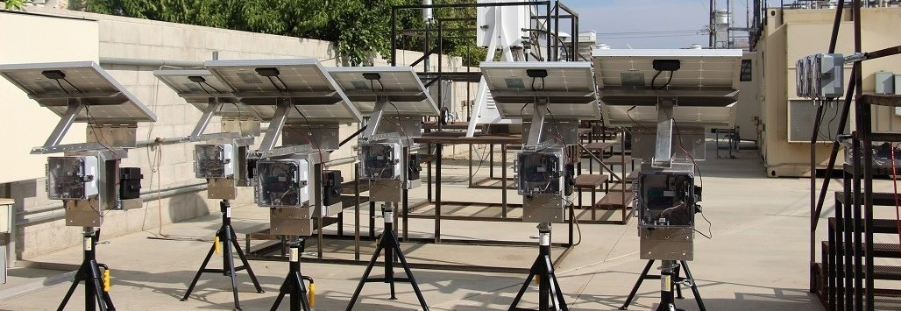
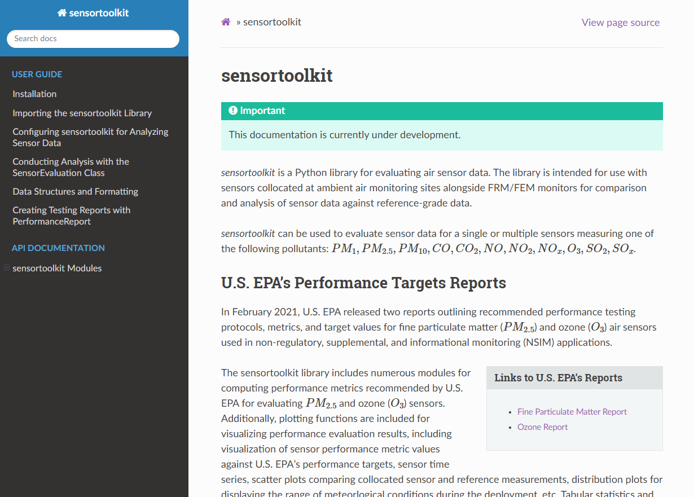

# sensortoolkit (v0.4.5 beta 9) - Air Sensor Data Analysis Library

{width=1200}

**Warning: This code is currently under development and is intended for internal EPA use only. Please do not distribute or share components of this repository with individuals external to EPA.**

*Samuel Frederick, NSSC Contractor (ORAU)*\
*Office: 919-541-4086 | Email: frederick.samuel@epa.gov*

****
## Readme Guide
* [Overview](#overview)
  * [Key Features](#key-features)
  * [Dependencies](#dependencies)
  * [Contact and Resources](#contact)
* [Installation](#install)
<!--
* [Using SensorEvaluation](#use)
  * [Adding a Sensor to the Library](#add-sensor)
  * [Running SensorEvaluation](#run)
    * [Example using AirNow reference data](#example-airnow)
    * [Example using AQS reference data](#example-aqs)
    * [Example using AirNowTech reference data](#example-airnowtech)
* [Data Dictionary](#dict)
  * [Sensor Data](#dict-sensor)
  * [Reference Data](#dict-reference)
* [Modules](#modules)
-->

## Overview <a name="overview"></a>
A Python library for evaluating the performance of air sensors for use in
ambient, outdoor, fixed site, non-regulatory supplemental and informational
monitoring applications.

In February 2021, EPA released [two reports](https://www.epa.gov/air-sensor-toolbox/air-sensor-performance-targets-and-testing-protocols#reports) detailing recommended performance testing protocols, metrics, and target values for the evaluation of sensors measuring either fine particulate matter (PM<sub>2.5</sub>) or ozone (O<sub>3</sub>). This library provides modules for testing air sensors measuring PM<sub>2.5</sub> and O<sub>3</sub> against FRM/FEM reference measurements collected at an ambient air monitoring site. Included modules utilize the performance metrics and target ranges recommended by EPA.

## Key features: <a name="key-features"></a>
* Class-based approach for analyzing sensor data in a consistent, reproduceable manner. Evaluation of sensor performance for fine particulate matter and ozone against EPA's recommended performance metrics and target values.
* Time averaging of timeseries data to 1-hour and 24-hour intervals with configurable data completeness threshold for computing averages (default 75%).
* Reference data retrieval from AirNow and AQS APIs (user API accounts and keys must be specified). Ingestion of reference data into a consistent data formatting standard. Import and ingestion of reference data from AirNowTech including multiple parameters and pollutant types. Reference data are sorted by parameter type (particulate matter, gaseous pollutants, and meteorological parameters) and files are saved in monthly increments to .csv files.
* Modules for visualizing sensor performance at 1-hour and 24-hour intervals: timeseries plots for examining how sensor and reference measurements track with changes in ambient concentrations during the testing period, scatter plots for displaying the accuracy and bias between sensor and reference measurement pairs, etc.

Users must provide an ingestion module for importing recorded sensor data into a data formatting standard developed for this project.

## Dependencies: <a name="dependencies"></a>
* [Python](https://www.python.org/) 3.7, 3.8
* [pandas](https://pypi.org/project/pandas/) >= 0.25.1
* [numpy](https://pypi.org/project/numpy/) >= 1.16.5
* [matplotlib](https://pypi.org/project/matplotlib/) >= 3.1.1
* [seaborn](https://pypi.org/project/seaborn/) >= 0.9.0
* [statsmodels](https://pypi.org/project/statsmodels/) >= 0.10.1
* [pathlib2](https://pypi.org/project/pathlib2/) >= 2.3.5
* [requests](https://pypi.org/project/requests/) >= 2.25.1
* [python-pptx](https://pypi.org/project/python-pptx/) 0.6.18

## Contact and Resources <a name="contact"></a>
*Please direct all inquiries to*\
&nbsp;&nbsp;&nbsp;&nbsp;Andrea Clements Ph.D., Research Physical Scientist\
&nbsp;&nbsp;&nbsp;&nbsp;U.S. EPA, Office of Research and Development\
&nbsp;&nbsp;&nbsp;&nbsp;Center for Environmental Measurement and Modeling\
&nbsp;&nbsp;&nbsp;&nbsp;Air Methods & Characterization Division, Source and Fine Scale Branch\
&nbsp;&nbsp;&nbsp;&nbsp;109 T.W. Alexander Drive, Research Triangle Park, NC  27711\
&nbsp;&nbsp;&nbsp;&nbsp;Office: 919-541-1363 | Email: clements.andrea@epa.gov

Additional information about EPA's research involving air sensors including the reports for fine particulate matter sensors and ozone sensors, past evaluation results, and additional documentation are located at EPA's [Air Sensor Toolbox](https://www.epa.gov/air-sensor-toolbox).

****
## Installation <a name="install"></a>

***The following installation guide is pulled from the HTML formatted documentation packaged alongside `sensortoolkit`. Once the repository has been downloaded, users
are strongly recommended to follow the remainder of the documentation via the HTML
documentation. The HTML documentation contain greater detail about implementing the
`sensortoolkit` library, detailed API documentation, as well as formatted tips, notes, and recommendations for using the library.***

To open the included HTML documentation, first navigate to the repository folder.  Go to docs -> build -> html. Double click to open the file named `index.html`, which is the main landing page for the documentation. The documentation should open in a browser, and look like the following landing page:

{width=800}

Note: Users will need an installation of Python (v3.7 or greater). It’s
highly recommended that users download an Anaconda distribution of
Python. Anaconda is a package distribution of Python that includes many
widely used libraries as well as the Spyder IDE for editing and
compiling code. Anaconda is free for individuals.

### 1. Clone the repository on BitBucket:

There are a couple ways this can be done, either via a program with a UI
like SourceTree or via a command-line interface. For users just getting
starting with how to use Git, Bitbucket has a [tutorial] on how to clone
repositories that may be helpful. From the terminal, the repository can
be cloned via the following command

    git clone https://bitbucket.epa.gov/scm/~sfrede01/sensortoolkit.git

### 2. Install `sensortoolkit`

First, navigate to the folder location for the cloned repository:

```
cd path/to/sensortoolkit
```

Next, install the library with pip:

```
pip install .
```

Users will see something similar to the following be printed to the
console:
```
Processing c:\users\..\documents\sensortoolkit
Requirement already satisfied: matplotlib in c:\users\sfrede01\anaconda3\lib\site-packages (from sensortoolkit==0.1.0b2) (3.3.4)
Requirement already satisfied: numpy in c:\users\sfrede01\anaconda3\lib\site-packages (from sensortoolkit==0.1.0b2) (1.20.1)
Requirement already satisfied: pandas in c:\users\sfrede01\anaconda3\lib\site-packages (from sensortoolkit==0.1.0b2) (1.2.4)
Requirement already satisfied: pathlib2 in c:\users\sfrede01\anaconda3\lib\site-packages (from sensortoolkit==0.1.0b2) (2.3.5)
Requirement already satisfied: python-pptx in c:\users\sfrede01\anaconda3\lib\site-packages (from sensortoolkit==0.1.0b2) (0.6.18)
Requirement already satisfied: requests in c:\users\sfrede01\anaconda3\lib\site-packages (from sensortoolkit==0.1.0b2) (2.25.1)
Requirement already satisfied: scipy in c:\users\sfrede01\anaconda3\lib\site-packages (from sensortoolkit==0.1.0b2) (1.6.2)
Requirement already satisfied: seaborn in c:\users\sfrede01\anaconda3\lib\site-packages (from sensortoolkit==0.1.0b2) (0.11.1)
Requirement already satisfied: statsmodels in c:\users\sfrede01\anaconda3\lib\site-packages (from sensortoolkit==0.1.0b2) (0.12.2)
Requirement already satisfied: urllib3 in c:\users\sfrede01\anaconda3\lib\site-packages (from sensortoolkit==0.1.0b2) (1.26.4)
Requirement already satisfied: pip in c:\users\sfrede01\anaconda3\lib\site-packages (from sensortoolkit==0.1.0b2) (21.0.1)
Requirement already satisfied: pyparsing!=2.0.4,!=2.1.2,!=2.1.6,>=2.0.3 in c:\users\sfrede01\anaconda3\lib\site-packages (from matplotlib->sensortoolkit==0.1.0b2) (2.4.7)
Requirement already satisfied: pillow>=6.2.0 in c:\users\sfrede01\anaconda3\lib\site-packages (from matplotlib->sensortoolkit==0.1.0b2) (8.2.0)
Requirement already satisfied: python-dateutil>=2.1 in c:\users\sfrede01\anaconda3\lib\site-packages (from matplotlib->sensortoolkit==0.1.0b2) (2.8.1)
Requirement already satisfied: kiwisolver>=1.0.1 in c:\users\sfrede01\anaconda3\lib\site-packages (from matplotlib->sensortoolkit==0.1.0b2) (1.3.1)
Requirement already satisfied: cycler>=0.10 in c:\users\sfrede01\anaconda3\lib\site-packages (from matplotlib->sensortoolkit==0.1.0b2) (0.10.0)
Requirement already satisfied: six in c:\users\sfrede01\anaconda3\lib\site-packages (from cycler>=0.10->matplotlib->sensortoolkit==0.1.0b2) (1.15.0)
Requirement already satisfied: pytz>=2017.3 in c:\users\sfrede01\anaconda3\lib\site-packages (from pandas->sensortoolkit==0.1.0b2) (2021.1)
Requirement already satisfied: lxml>=3.1.0 in c:\users\sfrede01\anaconda3\lib\site-packages (from python-pptx->sensortoolkit==0.1.0b2) (4.6.3)
Requirement already satisfied: XlsxWriter>=0.5.7 in c:\users\sfrede01\anaconda3\lib\site-packages (from python-pptx->sensortoolkit==0.1.0b2) (1.3.8)
Requirement already satisfied: chardet<5,>=3.0.2 in c:\users\sfrede01\anaconda3\lib\site-packages (from requests->sensortoolkit==0.1.0b2) (4.0.0)
Requirement already satisfied: idna<3,>=2.5 in c:\users\sfrede01\anaconda3\lib\site-packages (from requests->sensortoolkit==0.1.0b2) (2.10)
Requirement already satisfied: certifi>=2017.4.17 in c:\users\sfrede01\anaconda3\lib\site-packages (from requests->sensortoolkit==0.1.0b2) (2020.12.5)
Requirement already satisfied: patsy>=0.5 in c:\users\sfrede01\anaconda3\lib\site-packages (from statsmodels->sensortoolkit==0.1.0b2) (0.5.1)
Building wheels for collected packages: sensortoolkit
  Building wheel for sensortoolkit (setup.py) ... done
  Created wheel for sensortoolkit: filename=sensortoolkit-0.1.0b2-py3-none-any.whl size=264195 sha256=255f3b7f2818bc10ed695d7bbdf9facfcde8fbe88866621d77cba99376ef8fbb
  Stored in directory: C:\Users\SFREDE01\AppData\Local\Temp\pip-ephem-wheel-cache-k4dnnl3u\wheels\d0\5d\9f\8f5c8d55a67e2c9d9ff85111d0e96da3ef3782e3356c46e010
Successfully built sensortoolkit
Installing collected packages: sensortoolkit
Successfully installed sensortoolkit-0.1.0b2
```

### *Note*
The above console output indicates that the dependencies for ``sensortoolkit``
were previously installed and found on the user's system. Any packages not found
during installation will be installed by pip.

<!--
### Install package dependencies:

<span class="title-ref">conda</span> and <span
class="title-ref">pip</span> are two popular package managers for
installing python packages and manage the dependency structure for the
packages the user wishes to install. Below are guides for installing
dependencies for <span class="title-ref">senortoolkit</span> in either
<span class="title-ref">conda</span> or <span
class="title-ref">pip</span>.

**Please note, users should either follow the conda installation process
using a virtual environment or install dependencies with pip.**

### Installing dependencies in a conda virtual environment

If users have an Anaconda distribution of Python, users may wish to
create a virtual environment via <span class="title-ref">conda</span>
for installing the dependencies required by the <span
class="title-ref">sensortoolkit</span> library. The benefit of a virtual
environment is that software package versions required by the library
won't modify package versions in the default base environment (a virtual
environment creates a walled garden where users can install the packages
and the package versions they require without changing the state or
version of packages installed in the base environment).

<span class="title-ref">sensortoolkit</span> comes with the file
`env.yml` that allows easy installation of dependencies into a <span
class="title-ref">conda</span> virtual environment named `sensor-eval`.
First, navigate to the folder location for the cloned repository: :: $
cd path/to/library

Next, create the virtual environment from the provided `env.yml` file.
This will install various packages that are required by the <span
class="title-ref">sensortoolkit</span> library.

    $ conda env create -f env.yml

Finally, activate the environment to use packages installed in the
environment:

    $ conda activate sensor-eval

If the environment has been activate successfully, the command prompt
should display the environment name in parentheses before the system
prompt `$`:

    (sensor-eval) $

Tip

To exit the `sensor-eval` environment, type: `conda deactivate`

### Installing dependencies with pip

Warning

<span class="title-ref">conda</span> users are discouraged from using
pip to install dependencies, as packages installed via <span
class="title-ref">pip</span> may supersede previously installed packages
via <span class="title-ref">conda</span>. In addition, <span
class="title-ref">conda</span> and <span class="title-ref">pip</span>
manage dependencies differently, and this may lead to potential issues
if users wish to update package versions at a future point.

First, navigate to the folder location for the cloned repository: :

    $ cd path/to/library

A list of dependencies and package versions is provided in the
`requirements.txt` file within the main directory of the library.
Dependencies are installed with <span class="title-ref">pip</span> via
the following command:

    $ pip install –r requirements.txt --user

### Run `setup.py`

The last step in the installation process is ensuring that the
`sensortoolkit` package modules can be imported from any directory
location on a users system. For Anaconda users, packages are placed in a
directory location with a path that should look something like
`user/Anaconda3/Lib/site-packages`.

To run the setup.py module, open a command line utility and ensure that
the current directory is the location of the cloned repository. Then
type the following command:

    $ python setup.py install
-->

<!--
Recommended Software:
* [Anaconda](https://www.anaconda.com/) distribution of Python
  * Package management including version control and dependency installation with `conda`
  * Spyder IDE for running scripts and visualizing datasets
* [git](https://git-scm.com/) or a git client that allows for interfacing with git, downloading online repositories, and pushing suggested changes to the repository codebase.


Steps to get started using SensorEvaluation:
1. Clone the Sensor Evaluation repository. There are a couple ways this can be done, either via a program with a UI like SourceTree or via terminal command. For users just getting starting with how to use Git, Bitbucket has a tutorial [webpage](https://www.atlassian.com/git/tutorials/setting-up-a-repository/git-clone?utm_campaign=learn-git-clone&utm_medium=in-app-help&utm_source=stash) on how to clone repositories that may be helpful.
2. There are a number of python library dependencies that the Sensor Evaluation library will need to work properly. If users have an environment management system like Conda installed (included in Anaconda distributions of Python), users may wish to create a virtual environment for installing the dependencies required by the Sensor Evaluation Library. The benefit of a virtual environment is that software package versions required by the Sensor Evaluation Library won't override package versions in the default base environment; a virtual environment creates a walled garden where users can install the packages and the package versions they require without changing the state or version of packages installed in the base environment.    
3. Once the library has been downloaded and users have an installation of Python, navigate to the location of the SensorEvaluation library and copy the folder path. If users have Anaconda installed, search for ‘Anaconda Prompt’ from the task bar search and open an instance.
    * Type `cd path/to/sensorevaluation` where `path/to/sensorevaluation` is replaced by the full path previous copied to the clipboard. Press enter   and the prompt will change directories to the `sensorevaluation` folder.
    * Type `pip install –r requirements.txt --user` to install the various libraries required by SensorEvaluation.


****
## Using SensorEvaluation <a name="use"></a>

### Adding a Sensor to the Library <a name="add-sensor"></a>
The SensorEvaluation library comes with an example sensor dataset. The example sensor is given the name `Example_Make_Model` and users are encouraged to adopt a similar naming scheme for conducting analysis with the sensor name comprised of the manufacturer make and sensor model separated by an underscore '_'. The example sensor dataset is provided to help users familiarize themselves with the structure of the library's supporting files and the functionality of modules within the library.

Data, figures, and statistical results for sensors must be located in the `Data and Figures` folder. Below is a diagram showing the file structure for the Sensor Evaluation library with the `Data and Figures` folder on the first branch. Within this folder, subfolders contain evaluation statistics, figures, reference data, and sensor data (including both recorded or 'raw' and processed datasets). The `eval_stats`, `figures`, and `sensor_data` subfolders are further organized by sensor name.

###### Library file structure
```
├───Data and Figures
│   ├───eval_stats
│   │   └───Example_Make_Model
│   ├───figures
│   │   ├───Example_Make_Model
│   │   │   ├───deployment
│   │   │   ├───Met
│   │   │   ├───O3
│   │   │   └───PM25
│   │   └───_readme_
│   ├───reference_data
│   │   ├───airnow
│   │   │   ├───processed
│   │   │   └───raw_api_datasets
│   │   ├───airnowtech
│   │   │   ├───downloaded_datasets
│   │   │   └───processed
│   │   ├───aqs
│   │   │   ├───processed
│   │   │   └───raw_api_datasets
│   │   └───method_codes
│   └───sensor_data
│       └───Example_Make_Model
│           ├───processed_data
│           └───raw_data
├───Documentation
├───Reports
│   ├───Example_Make_Model
│   │   ├───O3
│   │   └───PM25
│   ├───templates
│   │   ├───O3
│   │   └───PM25
│   └───__pycache__
└───Sensor_Evaluation
    ├───_analysis
    │   └───__pycache__
    ├───_format
    │   └───__pycache__
    ├───_ingest
    │   └───__pycache__
    ├───_models
    │   └───__pycache__
    ├───_plotting
    │   └───__pycache__
    ├───_reference
    │   └───__pycache__
    └───__pycache__
```

Users can call the `Create_Sensor_Directories()` function to add subdirectories for sensor data, figures, and statistics. **It is important that users follow the sensor-specific folder structure shown above for the `Example_Make_Model` with their own sensors by using the `Create_Sensor_Directories()` function or by manually creating subdirectories. Otherwise, the SensorEvaluation library will not be able to read or write data and figures to the expected folder location.** Below is an example illustrating use of the `Create_Sensor_Directories()` function. The parameter `name` is sensor name (users are encouraged to follow the sensor naming scheme discussed above) and the parameter `eval_params` is a list of the pollutants measured by the sensor which the user intends to evaluate.

```python
# Create sub directories for sensor data, figures, etc.
Sensor_Evaluation.Create_Sensor_Directories(name='New_Sensor_Make_Model',
                                            eval_params=['PM25', 'O3'])
```
The following is printed to the console indicating directories and sub-directories generated by the `Create_Sensor_Directories()` function call:
```
Creating directories for New_Sensor_Make_Model and evaluation parameters: PM25, O3
..Creating directory:
....\Data and Figures\eval_stats\New_Sensor_Make_Model
..Creating directory:
....\Data and Figures\figures\New_Sensor_Make_Model
....Creating sub-directory:
......\Data and Figures\figures\New_Sensor_Make_Model\PM25
....Creating sub-directory:
......\Data and Figures\figures\New_Sensor_Make_Model\O3
....Creating sub-directory:
......\Data and Figures\figures\New_Sensor_Make_Model\Met
....Creating sub-directory:
......\Data and Figures\figures\New_Sensor_Make_Model\deployment
..Creating directory:
....\Data and Figures\sensor_data\New_Sensor_Make_Model
....Creating sub-directory:
......\Data and Figures\sensor_data\New_Sensor_Make_Model\processed_data
....Creating sub-directory:
......\Data and Figures\sensor_data\New_Sensor_Make_Model\raw_data
```
### Running SensorEvaluation <a name="run"></a>
Analysis is built around the `SensorEvaluation` class. To begin analysis, users create an instance of the class where various attributes are declared upon instantiation (e.g., the name of the sensor `sensor_name`, the evaluation parameter `eval_param`, the location of reference data or name of API service to query `reference_data`, a dictionary containing serial identifiers for each sensor unit tested `serials`, shifting of sensor data by hourly intervals to time align sensor data timestamps with reference data `tzone_shift`, etc.).

Upon creation of a class instance, the user must indicate what reference data to use. Users can either specify that reference data should be retrieved by API query (AirNow or AQS) or imported from a local destination (e.g., .csv files downloaded from AirNowTech). Note that both the AirNow and AQS APIs require users have an account and key to complete successful queries. AirNowTech also requires a user account to access its online data portal. Accounts for these services are free and can created via the following links ([AirNowTech account request](https://www.airnowtech.org/requestAccnt.cfm), [AirNow API account request](https://docs.airnowapi.org/account/request/), [AQS API sign up](https://aqs.epa.gov/aqsweb/documents/data_api.html#signup)).

Below, numerous examples are given for creating a class instance `eval`. If the user specifies that either the AirNow or AQS API should be queried for retrieving reference data, the user must specify API dependent parameters. More detail about each scenario is provided for the following examples.


#### Example using AirNow for retrieving reference data <a name="example-airnow"></a>
In order to specify the location of reference data to query, AirNow requires that users pass a bounding box indicating a range of latitude and longitude to the API.

Users are encouraged to configure a bounding box with narrow margins as shown below. This reduces the likelihood that data from multiple nearby air monitoring sites will be returned by the API.

In addition, users must specify an AirNow account key to query the API. More information about obtaining an AirNow account can be found [here](https://docs.airnowapi.org/account/request/).
```python
from Sensor_Evaluation.sensor_eval_class import SensorEvaluation

# bounding box for AIRS [set narrow margins (+/- 0.01 deg) around known coordinates]
AIRS_bbox = {"minLat": "35.88",
             "maxLat": "35.89",
             "minLong": "-78.88",
             "maxLong": "-78.87"}

# AirNow credentials
SensorEvaluation.airnow_key = 'Your-AirNow-Key-Here'

# Mock evaluation using AIRS reference data obtained from the AirNow API
eval = SensorEvaluation(sensor_name='Example_Make_Model',
                        eval_param='PM25',
                        reference_data='AirNow',
                        bbox=AIRS_bbox,
                        serials={'1': 'SN01',
                                 '2': 'SN02',
                                 '3': 'SN03'},
                        tzone_shift=5,
                        load_raw_data=False,
                        write_to_file=False)
```
When creating an evaluation class instance with the code snippet above, the following will be printed to the console:
```
Loading processed sensor data
..Example_Make_Model_SN01_daily.csv
..Example_Make_Model_SN01_full.csv
..Example_Make_Model_SN01_hourly.csv
..Example_Make_Model_SN02_daily.csv
..Example_Make_Model_SN02_full.csv
..Example_Make_Model_SN02_hourly.csv
..Example_Make_Model_SN03_daily.csv
..Example_Make_Model_SN03_full.csv
..Example_Make_Model_SN03_hourly.csv
Querying AirNow API
..Query start: 2019-08-01
..Query end: 2019-08-31
..Query site(s):
....Site name: Burdens Creek
......AQS ID: 37-063-0099
......Latitude: 35.8894
......Longitude: -78.8747
..Query Status: Success
Querying AirNow API
..Query start: 2019-09-01
..Query end: 2019-09-30
..Query site(s):
....Site name: Burdens Creek
......AQS ID: 37-063-0099
......Latitude: 35.8894
......Longitude: -78.8747
..Query Status: Success
Writing AirNow query dataframes to csv files
../reference_data/airnow/processed/AirNow_37-063-0099_PM25_B190801_E190902.csv
../reference_data/airnow/raw_api_datasets/AirNow_raw_37-063-0099_PM25_B190801_E190902.csv
Computing normalized PM25 values (by Unknown Reference)
Computing normalized PM25 values (by Unknown Reference)
Computing mean parameter values across concurrent sensor datasets
Computing mean parameter values across concurrent sensor datasets
```
Below is a step-by-step description of the console output:
* Processed sensor data are loaded
* The AirNow API is queried in monthly intervals for `PM25` reference data recorded at monitoring sites within the specified bounding box. AirNow returns a successful query, and the console indicates data were retrieved from the Burdens Creek monitoring site. AirNow data are then parsed into the reference data format described in the reference data dictionary below. Both raw (datasets as returned by the API) and processed datasets are written to .csv files at the folder path indicated.
* Sensor `PM25` concentrations are normalized against reference measurements (AirNow does not indicate the name of the reference instrument for the evaluation parameter, so the reference is referred to as `Unknown Reference`).
* The mean across sensor measurements is also calculated.

#### Example using AQS for retrieving reference data <a name="example-aqs"></a>
In order to specify the location of reference data to query, AQS requires that users provide the AQS site ID for the monitoring site of interest. The AQS site ID is composed of three components: state and county FIPS codes, and a site specific identifier.

To explore nearby sites, users may use EPA's [AirData Map](https://epa.maps.arcgis.com/apps/webappviewer/index.html?id=5f239fd3e72f424f98ef3d5def547eb5&extent=-146.2334,13.1913,-46.3896,56.5319), which allows users to view active (and inactive) monitors for crtieria pollutants at monitoring sites across the U.S. Clicking on map icons for monitors brings up a brief description of the site (including the site AQS ID), as well as details about the monitor and historical data.

In addition, users must specify an AQS account username (registered email) and a key to query the API. More information about obtaining an AQS account can be found [here](https://aqs.epa.gov/aqsweb/documents/data_api.html#signup).
```python
from Sensor_Evaluation.sensor_eval_class import SensorEvaluation

# Triple Oak air monitoring site AQS ID (nearby sensor deployment site)
triple_oaks_ID = {"state": "37",
                  "county": "183",
                  "site": "0021"}

# AQS credentials
SensorEvaluation.aqs_username = 'username_address@email.com'
SensorEvaluation.aqs_key = 'Your-AQS-Key-Here'

# Mock evaluation using Triple Oaks reference data obtained from the AQS API
eval = SensorEvaluation(sensor_name='Example_Make_Model',
                        eval_param='PM25',
                        reference_data='AQS',
                        aqs_id=triple_oaks_ID,
                        serials={'1': 'SN01',
                                 '2': 'SN02',
                                 '3': 'SN03'},
                        tzone_shift=5,
                        load_raw_data=False,
                        write_to_file=False)
```
When creating an evaluation class instance with the code snippet above, the following will be printed to the console:
```
Loading processed sensor data
..Example_Make_Model_SN01_daily.csv
..Example_Make_Model_SN01_full.csv
..Example_Make_Model_SN01_hourly.csv
..Example_Make_Model_SN02_daily.csv
..Example_Make_Model_SN02_full.csv
..Example_Make_Model_SN02_hourly.csv
..Example_Make_Model_SN03_daily.csv
..Example_Make_Model_SN03_full.csv
..Example_Make_Model_SN03_hourly.csv
Querying AQS API
..Query start: 2019-08-01
..Query end: 2019-08-31
..Query site(s):
....Site name: Triple Oak
......AQS ID: 37-183-0021
......Latitude: 35.8652
......Longitude: -78.8197
..Query Status: Success
Querying AQS API
..Query start: 2019-09-01
..Query end: 2019-09-30
..Query site(s):
....Site name: Triple Oak
......AQS ID: 37-183-0021
......Latitude: 35.8652
......Longitude: -78.8197
..Query Status: Success
Writing AQS query dataframes to csv files
../reference_data/aqs/processed/AQS_37-183-0021_PM25_B190801_E190902.csv
../reference_data/aqs/raw_api_datasets/AQS_raw_37-183-0021_PM25_B190801_E190902.csv
Computing normalized PM25 values (by Met One BAM-1022 PM2.5 w/ VSCC or TE-PM2.5C FEM)
Computing normalized PM25 values (by Met One BAM-1022 PM2.5 w/ VSCC or TE-PM2.5C FEM)
Computing mean parameter values across concurrent sensor datasets
Computing mean parameter values across concurrent sensor datasets
```
Below is a step-by-step description of the console output:
* Processed sensor data are loaded
* The AQS API is queried in monthly intervals for `PM25` reference data recorded at the Triple Oaks air monitoring site, which was selected based on its proximity to the site where the air sensor was deployed. AQS returns a successful query, and the console indicates data were retrieved from the Triple Oaks monitoring site for the months of August and September 2019. AQS data are then parsed into the reference data format described in the reference data dictionary below. Both raw (datasets as returned by the API) and processed datasets are written to .csv files at the folder path indicated.
* Sensor `PM25` concentrations are normalized against reference measurements (AQS indicates that the reference monitor is a Met One BAM-1022).
* The mean across sensor measurements is also calculated.

#### Example using downloaded AirNowTech datasets <a name="example-airnowtech"></a>
If users have an existing account with AirNowTech, datasets downloaded directly from the AirNowTech data portal can be imported via the `Import_AirNowTech()` module.

__[Specifics about data downloaded from AirNowTech]__
```python
from Sensor_Evaluation.sensor_eval_class import SensorEvaluation

ref_path = 'path/to/project/.../Sensor Evaluation/Data and Figures/reference_data'

# Pre-process downloaded AirNowTech file, create separate, monthly files for PM, gas, and met
airnowtech_path = (ref_path + '/airnowtech/downloaded_datasets/' +
                   'AirNowTech_BurdensCreek_20190801_20190902_PMGasMet.csv')
se.Import_AirNowTech(airnowtech_path)

# Mock evaluation using AIRS reference data downloaded from AirNowTech
eval = SensorEvaluation(
                sensor_name='Example_Make_Model',
                eval_param='PM25',
                reference_data=ref_path.as_posix() + '/airnowtech/processed',
                serials={'1': 'SN01',
                         '2': 'SN02',
                         '3': 'SN03'},
                tzone_shift=5,
                load_raw_data=False,
                write_to_file=True)
```

When creating an evaluation class instance with the code snippet above, the following will be printed to the console:
```
Loading processed sensor data
..Example_Make_Model_SN01_daily.csv
..Example_Make_Model_SN01_full.csv
..Example_Make_Model_SN01_hourly.csv
..Example_Make_Model_SN02_daily.csv
..Example_Make_Model_SN02_full.csv
..Example_Make_Model_SN02_hourly.csv
..Example_Make_Model_SN03_daily.csv
..Example_Make_Model_SN03_full.csv
..Example_Make_Model_SN03_hourly.csv
Loading reference dataframes
..2019-08
....H_201908_PM.csv
....H_201908_Met.csv
....H_201908_Gases.csv
..2019-09
....H_201909_PM.csv
....H_201909_Met.csv
....H_201909_Gases.csv
Computing normalized PM25 values (by T-API T640X at 16.67 LPM)
Computing normalized PM25 values (by T-API T640X at 16.67 LPM)
Computing mean parameter values across concurrent sensor datasets
Computing mean parameter values across concurrent sensor datasets
```
Below is a step-by-step description of the console output:
* Processed sensor data are loaded
* AirNowTech reference data for the sensor testing timeframe are loaded in monthly intervals for parameter types present in the recorded sensor data (`PM` for parameters headers labeled `PM1`, `PM25`, and `PM10`; `Gases` for parameters headers labeled `O3`, `NO2`, `NO`, `NOx`, `SO2`, `SOx`, `CO`, and `CO2`; `Met` for parameters headers labeled `Temp`, `RH`, `Press`, `DP`, `WS`, and `WD`). The test dataset includes `PM25`, `PM10`, `NO2`, `O3`, `Temp`, and `RH`, so reference data sets for `PM`, `Gases`, and `Met`.
* Sensor `PM25` concentrations are normalized against reference measurements.
* The mean across sensor measurements is also calculated.


****
## Data Dictionary <a name="dict"></a>

#### Sensor data <a name="dict-sensor"></a>
Below is a list of sensor parameters supported by the `SensorEvaluation` class. **Please note that currently, only `PM25` and `O3` are fully supported for all performance evaluation modules in accordance with EPA's [reports](https://www.epa.gov/air-sensor-toolbox/air-sensor-performance-targets-and-testing-protocols#reports) for these pollutants.** Limited functionality is available for all other pollutants.

| Parameter Classification | Parameter Label             | Description                                              | Units                       |
| ------------------------ | -------------------------- | -------------------------------------------------------- | --------------------------- |
| Pollutant; PM            | `PM1`                        | Particulate matter < 1 micrometer in aerosol diameter    | Micrograms/cubic meter      |
| Pollutant; Criteria; PM  | `PM25`                       | Particulate matter < 2.5 micrometers in aerosol diameter | Micrograms/cubic meter      |
| Pollutant; Criteria; PM  | `PM10`                       | Particulate matter < 10 micrometers in aerosol diameter  | Micrograms/cubic meter      |
| Pollutant; Criteria; Gas | `O3`                         | Ozone                                                    | Parts per billion by volume |
| Pollutant; Gas           | `NO`                         | Nitrogen Monoxide                                        |                             |
| Pollutant; Criteria; Gas | `NO2`                        | Nitrogen Dioxide                                         | Parts per billion by volume |
| Pollutant; Gas           | `NOx`                        | Nitrogen Oxides                                          |                             |
| Pollutant; Criteria; Gas | `SO2`                        | Sulfur Dioxide                                           | Parts per billion by volume |
| Pollutant; Gas           | `SOx`                        | Sulfur Dioxides                                          |                             |
| Pollutant; Criteria; Gas | `CO`                         | Carbon Monoxide                                          | Parts per million by volume |
| Pollutant; Gas           | `CO2`                        | Carbon Dioxide                                           |                             |
| Meteorological           | `RH`                         | Relative Humidity                                        | Percent                     |
| Meteorological           | `Temp`                       | Temperature                                              | Degrees Celsius             |
| Meteorological           | `DP`*                       | Dewpoint                                                 | Degrees Celsius             |
| Meteorological           | `WS`                         | Wind Speed                                               | Meters/second               |
| Meteorological           | `WD`                         | Wind Direction                                           | Radians                     |
| Meteorological           | `Press`                      | Pressure                                                 |                             |
| Metadata                 | `[param name]_QC`         | Parameter QC Code                                        | N/a                         |
| Metadata; Sensor Siting  | `Sensor_Lat`                | Latitude of sensor                                       | Decimal degrees             |
| Metadata; Sensor Siting  | `Sensor_Lon`                | Longitude of sensor                                      | Decimal degrees             |
| Performance evaluation   | `[param name]_Normalized` | Parameter data normalized by corresponding reference     | N/a                         |


*If internal Temp and RH are measured, but not DP, DP is calculated via the `Dewpoint()` module and is labeled `DP_calculated`
#### Reference data <a name="dict-reference"></a>
Below is a description of reference data formatting expected by the `SensorEvaluation` class. Example values result from `PM25` data queried from the AQS API for the Triple Oak monitoring site. The column naming scheme for parameter data is consistent across queried parameters (columns with the prefix '`PM25`' are replaced by the parameter of interest) and columns formatting is consistent across data sources. Note that the AirNow API does not return QC codes, parameter AQS codes, method names, method AQS codes, or parameter occurrence codes. These columns are set null (i.e., all values set to `numpy.nan`). In addition, AirNowTech does not return method names, site latitude, or site longitude, and these columns are set null if reference data from AirNowTech are selected.

| Column Header                 | Description                                          | Example                                         | Data type        |
| ----------------------------- | ---------------------------------------------------- | ----------------------------------------------- | ---------------- |
| `DateTime_UTC`                 | Timestamp, set as index                                            | `8/1/2019 13:00`                                  | `datetime64[ns]` |
| `PM25_Value`                   | Parameter value                                      | `9`                                               | `float64`          |
| `PM25_Unit`                    | Parameter units                                      | `Micrograms/cubic meter (LC)`                     | `object`           |
| `PM25_QAQC_Code`              | Parameter QC code or AQS qualifier                                   | `V - Validated Value.`                            | `float64`          |
| `PM25_Param_Code`             | Parameter AQS code                                   | `88101`                                           | `float64`          |
| `PM25_Method`                  | Parameter method (Instrument)                        | `Met One BAM-1022 PM2.5 w/ VSCC or TE-PM2.5C FEM` | `object`           |
| `PM25_Method_Code`            | Parameter method AQS code                            | `209`                                             | `float64`          |
| `PM25_Method_POC`             | Parameter Occurance Code (POC)                             | `3`                                               | `float64`          |
| `Agency`                        | Reporting agency overseeing site                     | `North Carolina Dept Of Environmental Quality`    | `object`           |
| `Site_Name`                    | Name of monitoring site                              | `Triple Oak`                                      | `object`           |
| `Site_AQS`                     | Site AQS ID (state, county, site FIPS codes separated by '-') | `37-183-0021`                                     | `object`           |
| `Site_Lat`                     | Site latitude                                        | `35.8652`                                         | `float64`          |
| `Site_Lon`                     | Site longitude                                       | `-78.8197`                                       | `float64`          |
| `Data_Source`                  | Name of API data source                              | `AQS API`                                         | `object`           |
| `Data_Acquisition_Date_Time` | Date and time of data query, acquisition             | `5/18/2021 8:44`                                  | `datetime64[ns]`           |

Note that AirNow, AirNowTech, and AQS report QC or instrument status codes in different ways. AirNow reports `-999` if instrument failures or other issues occur, AirNowTech reports integer values ranging from 0 (normal operation) to `9` (instrument failure)

****

## Modules <a name="modules"></a>
#### `SensorEvaluation.print_eval_metrics()`
Results are printed to the console at the specified averaging interval for performance evaluation metrics including the coefficient of variation (CV), OLS regression slope and intercept, coefficient of determination (R<sup>2</sup>) and Root Mean Square Error (RMSE).

##### Parameters
&nbsp;&nbsp; __averaging_interval : *{'Hourly', 'Daily'}, default 'Daily'*__
*  The time averaging interval for sensor and reference data.

##### Example
```python
Eval.print_eval_metrics(avg_interval='Daily')
```

```
                Example_Make_Model Daily Performance Evaluation Results                 
                       Reference Method: T-API T640X at 16.67 LPM                       
----------------------------------------------------------------------------------------
  CV  |         Slope          |       Intercept        |          R^2           | RMSE
----------------------------------------------------------------------------------------
 7.1  |          0.87          |         -2.38          |          0.59          | 3.6  
      |     (0.84 to 0.92)     |    (-2.56 to -2.11)    |     (0.54 to 0.63)     |   
```

****

#### `SensorEvaluation.print_eval_conditions()`
Deployment site conditions are printed to the console for the specified averaging interval. The timeframe and duration of testing are included alongside pollutant concentrations and environmental parameters recorded during the testing period. The mean of sensor and reference pollutant concentrations, temperature, and relative humidity are all presented alongside the range of conditions (in parenthesis below mean values).

##### Parameters
&nbsp;&nbsp; __averaging_interval : *{'Hourly', 'Daily'}, default 'Daily'*__
*  The time averaging interval for sensor and reference data.

##### Example
```python
Eval.print_eval_conditions(avg_interval='Daily')
```

```
                   Example_Make_Model (3) Daily Evaluation Conditions                   
----------------------------------------------------------------------------------------
 Eval period  |   Duration   | Sensor PM25  |   Ref PM25   |     Temp     |      RH      
----------------------------------------------------------------------------------------
  08-01-19-   |   32 days    |     4.4      |     7.7      |      26      |      71      
   09-02-19   |              | (1.2 to 8.1) |(4.9 to 11.0) |  (21 to 29)  |  (60 to 88)  
```

****

#### `SensorEvaluation.plot_timeseries()`
Time series plots for 1-hour averaged and 24-hour averaged sensor and reference data. Sensor concentrations for each unit tested are depicted by discrete colors (e.g., red, green, blue, etc.) and reference concentrations are depicted in black.

##### Parameters
&nbsp;&nbsp; __averaging_interval : *{'Hourly', 'Daily'}, default 'Daily'*__
*  The time averaging interval for sensor and reference data.

##### Example
```python
# Timeseries plots for 1-hour averaged data
Eval.plot_timeseries(averaging_interval='1-hour')
```
{width=1200}

```python
# Timeseries plots for 24-hour averaged data
Eval.plot_timeseries(averaging_interval='24-hour')
```
{width=1200}

****

#### `SensorEvaluation.plot_sensor_scatter()`
Sensor (y-axis) vs. reference (x-axis) scatter plot. Separate plots are generated for each sensor unit tested

##### Parameters
&nbsp;&nbsp; __averaging_interval : *{'1-hour', '24-hour'}, default '24-hour'*__
*  The time averaging interval for sensor and reference data.

&nbsp;&nbsp; __plot_limits : *tuple, default (-1, 25)*__
* The x-axis and y-axis plot limits. By default both axes are set to have the same limits to preserve square dimensions of plots. If users require more customization, separate axes limits can be passed to the `sensor_evaluation.Scatter_Plotter()` plotting module.

&nbsp;&nbsp; __point_size : *int, default 20*__
*  The size of scatter plot points.

&nbsp;&nbsp; __tick_spacing : *int, default 5*__
*  The spacing between axes ticks and corresponding grid marks. Values are expressed in pollutant concentrations (micrograms per cubic meter for particulate matter, parts per billion by volume for ozone).

&nbsp;&nbsp; __RH_colormap : *bool, default True*__
*  Description.

&nbsp;&nbsp; __report_fmt : *bool, default False*__
*  Description.

&nbsp;&nbsp; __text_pos : *{'upper_left', 'bottom_right'}, default 'upper_left'*__
*  Description.

&nbsp;&nbsp; __plot_title : *bool, default True*__
*  Description.

&nbsp;&nbsp; __plot_title : *list, default None*__
*  Description.

##### Example
```Python
Eval.plot_sensor_scatter(averaging_interval='1-hour',
                         plot_limits=(-1, 20),
                         axes_spacing=5,
                         text_pos='upper_left')
```
```
Creating subplot for 3 sensors with 1 row and 3 columns
Computing regression statistics for Example_Make_Model vs T-API T640X at 16.67 LPM
Computing regression statistics for Example_Make_Model vs T-API T640X at 16.67 LPM
Computing regression statistics for Example_Make_Model vs T-API T640X at 16.67 LPM
```
{width=1000}

****

#### `SensorEvaluation.plot_metrics()`
__Description under construction.__

##### Example
```python
Eval.plot_metrics()
```
{width=1200}

****

#### `SensorEvaluation.plot_met_influence()`
__Description under construction.__

##### Example
```python
Eval.plot_met_influence()
```
****

#### `SensorEvaluation.plot_met_dist()`
__Description under construction.__

##### Example
```python
Eval.plot_met_dist()
```
{width=600}

****
Formatting stuff

# Level 1 *Level 1* __Level 1__
## Level 2 *Level 2* __Level 2__
### Level 3 *Level 3* __Level 3__
#### Level 4 *Level 4* __Level 4__
##### Level 5 *Level 5* __Level 5__
###### Level 6 *Level 6* __Level 6__

Regular text\
*Italic*\
__Bold__\
~~strikethrough~~
-->
