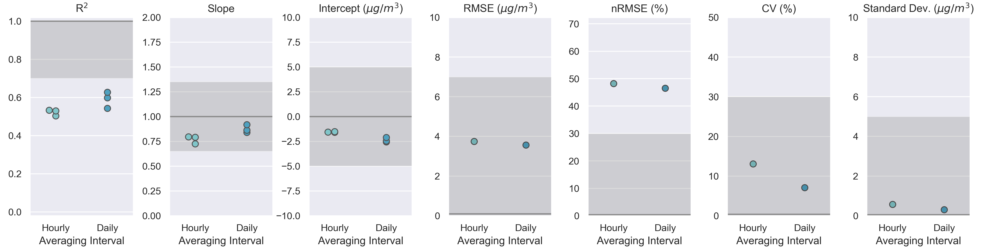

# Air Sensor Evaluation Library

*Samuel Frederick, NSSC Contractor (ORAU)*\
*Office: 919-541-4086 | Email: frederick.samuel@epa.gov*

A Python library for evaluating the performance of air sensors for use in
ambient, outdoor, fixed site, non-regulatory supplemental and informational
monitoring applications.

In February 2021, EPA released two reports detailing recommended
performance testing protocols, metrics, and target values for
the evaluation of sensors measuring either fine particulate matter (PM<sub>2.5</sub>)
or ozone (O<sub>3</sub>). This library provides modules for testing air sensors
measuring PM<sub>2.5</sub> and O<sub>3</sub> against FRM/FEM reference
measurements including calculation of performance metrics and comparison against
target ranges recommended by EPA.


Please direct all inquiries to:\
Andrea Clements Ph.D., Research Physical Scientist\
U.S. EPA, Office of Research and Development\
Center for Environmental Measurement and Modeling\
Air Methods & Characterization Division, Source and Fine Scale Branch\
109 T.W. Alexander Drive, Research Triangle Park, NC  27711\
Office: 919-541-1363 | Email: clements.andrea@epa.gov

```python
# Mock evaluation using AIRS reference data downloaded from AirNowTech
test = SensorEvaluation(
                sensor_name='Example_Make_Model',
                eval_param='PM25',
                reference_data=ref_path.as_posix() + '/airnowtech/processed',
                serials={'1': 'SN01',
                         '2': 'SN02',
                         '3': 'SN03'},
                tzone_shift=5,
                load_raw_data=False,
                write_to_file=True)
```



