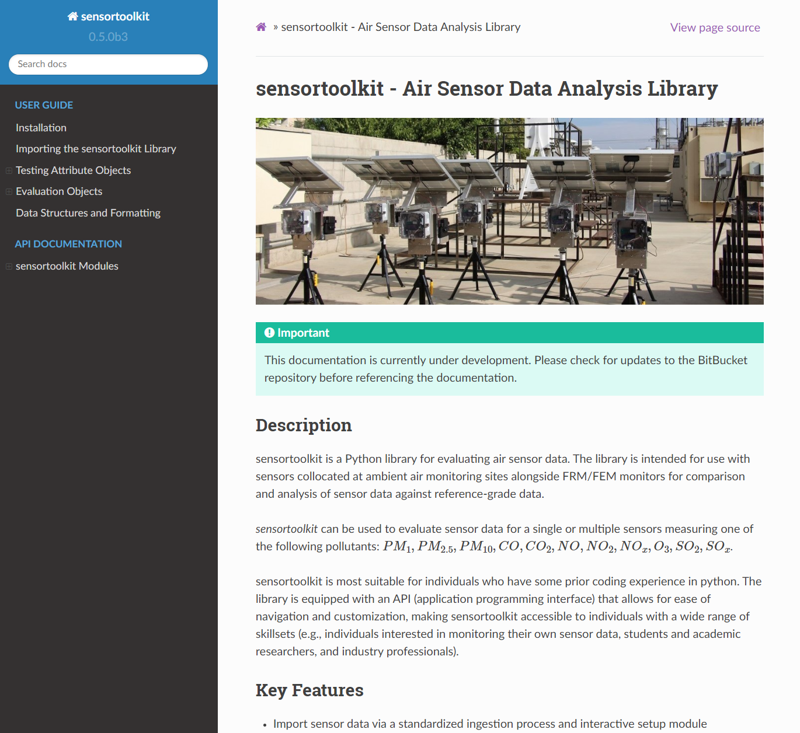

# sensortoolkit (v0.5.6 beta 1) - Air Sensor Data Analysis Library

{width=1200}

**Warning: This code is in beta development and has not been cleared for public use. Please do not distribute or share components of this repository with individuals external to EPA.**

*Samuel Frederick, NSSC Contractor (ORAU)*\
*Office: 919-541-4086 | Email: frederick.samuel@epa.gov*

****
## Readme Guide
* [Overview](#overview)
  * [Key Features](#key-features)
  * [Dependencies](#dependencies)
  * [Contact and Resources](#contact)
* [Installation](#install)

## Overview <a name="overview"></a>

sensortoolkit is a Python library for evaluating air sensor data. The
library is intended for use with sensors collocated at ambient air
monitoring sites alongside FRM/FEM monitors for comparison and analysis
of sensor data against reference-grade data.

<span class="title-ref">sensortoolkit</span> can be used to evaluate
sensor data for a single or multiple sensors measuring one of the
following pollutants: PM<sub>1</sub>, PM<sub>2.5</sub>, PM<sub>10</sub>, CO, CO<sub>2</sub>,
NO, NO<sub>2</sub>, NO<sub>x</sub>, O<sub>3</sub>, SO<sub>2</sub>, SO<sub>x</sub>.

sensortoolkit is most suitable for individuals who have some prior
coding experience in python. The library is equipped with an API
(application programming interface) that allows for ease of navigation
and customization, making sensortoolkit accessible to individuals with a
wide range of skillsets (e.g., individuals interested in monitoring
their own sensor data, students and academic researchers, and industry
professionals).

In February 2021, EPA released [two reports](https://www.epa.gov/air-sensor-toolbox/air-sensor-performance-targets-and-testing-protocols#reports) detailing recommended performance testing protocols, metrics, and target values for the evaluation of sensors measuring either fine particulate matter (PM<sub>2.5</sub>) or ozone (O<sub>3</sub>). The sensortoolkit library includes numerous modules for computing performance metrics recommended by U.S. EPA for evaluating PM<sub>2.5</sub> and O<sub>3</sub> sensors. Additionally, plotting functions are included for visualizing performance evaluation results, including visualization of sensor performance metric values against U.S. EPA’s performance targets, sensor time series, scatter plots comparing collocated sensor and reference measurements, distribution plots for displaying the range of meteorological conditions during the deployment, etc. Tabular statistics and figures can be automatically compiled into testing reports recommended by U.S. EPA’s performance targets documents for testing conducting at ambient air monitoring sites.

## Key features: <a name="key-features"></a>

**The primary goal of `sensortoolkit` is to provide a platform for
analyzing air sensor data regardless of formatting differences across
sensor data formatting schemes.** This goal extends to reference data as
well, and interactive setup modules are included for interpreting the
recorded format for datasets for subsequent Ingestion into standardized
formatting schemes for sensor and reference data.

-   Import sensor data via a standardized ingestion process and
    interactive setup module
-   Average to 1-hour and/or 24-hour averaging intervals.
-   Import FRM/FEM reference data from a variety of sources, including
    ingestion modules for importing data from AirNowTech, and modules
    for querying either the AQS or AirNow API services.
-   Submit queries for single or multiple parameters, parse datasets
    into a consistent reference data format and save unmodified and
    processed datasets to a data directory.
- Conduct analysis with the `SensorEvaluation` module  
-   Compute U.S. EPA’s recommended performance metrics for evaluating
    PM<sub>2.5</sub> and O<sub>3</sub> sensors.

-   Visualize sensor performance with various figures and save to file location.  
    -   Sensor vs. FRM/FEM scatter plots
    -   Timeseries indicating both sensor and FRM/FEM concentrations
    -   Performance metric results and comparison against target
        values/ranges.
    -   Save performance evaluation results, statistics, and
        supplemental information detailing the deployment conditions to
        a deployment JSON file.

-   Create testing reports using U.S. EPA’s base-testing report template
    (PowerPoint file) with the `PerformanceReport` module.
-   Additional modules are included for calculating quantities (AQI,
    PM<sub>2.5</sub> NowCast, application of sensor correction
    equations, the U.S. Wide correction equation for PurpleAir sensors
    via [Barkjohn et al. 2021](https://amt.copernicus.org/articles/14/4617/2021/), etc.) and conducting additional analysis
    (quality control modules for identifying outliers, invalidation of
    datapoints, A&B channel cleaning for PurpleAir data via [Barkjohn et al. 2021](https://amt.copernicus.org/articles/14/4617/2021/), etc.)
-   Access to modules utilized by the `SensorEvaluation` and `PerformanceReport` for greater customization
    in conducting analysis.


## Dependencies: <a name="dependencies"></a>
* [Python](https://www.python.org/) >=3.6
* [pandas](https://pypi.org/project/pandas/) >= 1.3.0
* [numpy](https://pypi.org/project/numpy/) >= 1.16.5
* [matplotlib](https://pypi.org/project/matplotlib/) >= 3.1.1
* [seaborn](https://pypi.org/project/seaborn/) >= 0.9.0
* [statsmodels](https://pypi.org/project/statsmodels/) >= 0.10.1
* [pathlib2](https://pypi.org/project/pathlib2/) >= 2.3.5
* [requests](https://pypi.org/project/requests/) >= 2.25.1
* [python-pptx](https://pypi.org/project/python-pptx/) >=0.6.18
* [SciPy](https://pypi.org/project/scipy/)
* [urllib3](https://pypi.org/project/urllib3/)
* [pip](https://pypi.org/project/pip/)

## Contact and Resources <a name="contact"></a>
*Please direct all inquiries to*\
&nbsp;&nbsp;&nbsp;&nbsp;Andrea Clements Ph.D., Research Physical Scientist\
&nbsp;&nbsp;&nbsp;&nbsp;U.S. EPA, Office of Research and Development\
&nbsp;&nbsp;&nbsp;&nbsp;Center for Environmental Measurement and Modeling\
&nbsp;&nbsp;&nbsp;&nbsp;Air Methods & Characterization Division, Source and Fine Scale Branch\
&nbsp;&nbsp;&nbsp;&nbsp;109 T.W. Alexander Drive, Research Triangle Park, NC  27711\
&nbsp;&nbsp;&nbsp;&nbsp;Office: 919-541-1363 | Email: clements.andrea@epa.gov

Additional information about EPA's research involving air sensors including the reports for fine particulate matter sensors and ozone sensors, past evaluation results, and additional documentation are located at EPA's [Air Sensor Toolbox](https://www.epa.gov/air-sensor-toolbox).

****
## Installation <a name="install"></a>

***The following installation guide is pulled from the HTML formatted documentation packaged alongside `sensortoolkit`. Once the repository has been downloaded, users
are strongly recommended to follow the remainder of the documentation via the HTML
documentation. The HTML documentation contain greater detail about implementing the
`sensortoolkit` library, detailed API documentation, as well as formatted tips, notes, and recommendations for using the library.***

To open the included HTML documentation, open a command line interface and ensure that the current working directory is the folder location
where the repository was downloaded. Next, type the following command and hit enter:
```
python opendocs.py
```
The documentation should open in your default browser, and you should see a landing page that looks something like this:

{width=800}

Note: Users will need an installation of Python (v3.6 or greater). It’s
highly recommended that users download an Anaconda distribution of
Python. Anaconda is a package distribution of Python that includes many
widely used libraries as well as the Spyder IDE for editing and
compiling code. Anaconda is free for individuals.

### 1. Clone the repository on BitBucket:

There are a couple ways this can be done, either via a program with a UI
like SourceTree or via a command-line interface. For users just getting
starting with how to use Git, Bitbucket has a [tutorial] on how to clone
repositories that may be helpful. From the terminal, the repository can
be cloned via the following command

    git clone https://bitbucket.epa.gov/scm/~sfrede01/sensortoolkit.git

### 2. Install `sensortoolkit`

First, navigate to the folder location for the cloned repository:

```
cd path/to/sensortoolkit
```

Next, install the library with pip:

```
pip install .
```

Users will see something similar to the following be printed to the
console:
```
Processing c:\users\..\documents\sensortoolkit
Requirement already satisfied: matplotlib in c:\users\sfrede01\anaconda3\lib\site-packages (from sensortoolkit==0.1.0b2) (3.3.4)
Requirement already satisfied: numpy in c:\users\sfrede01\anaconda3\lib\site-packages (from sensortoolkit==0.1.0b2) (1.20.1)
Requirement already satisfied: pandas in c:\users\sfrede01\anaconda3\lib\site-packages (from sensortoolkit==0.1.0b2) (1.2.4)
Requirement already satisfied: pathlib2 in c:\users\sfrede01\anaconda3\lib\site-packages (from sensortoolkit==0.1.0b2) (2.3.5)
Requirement already satisfied: python-pptx in c:\users\sfrede01\anaconda3\lib\site-packages (from sensortoolkit==0.1.0b2) (0.6.18)
Requirement already satisfied: requests in c:\users\sfrede01\anaconda3\lib\site-packages (from sensortoolkit==0.1.0b2) (2.25.1)
Requirement already satisfied: scipy in c:\users\sfrede01\anaconda3\lib\site-packages (from sensortoolkit==0.1.0b2) (1.6.2)
Requirement already satisfied: seaborn in c:\users\sfrede01\anaconda3\lib\site-packages (from sensortoolkit==0.1.0b2) (0.11.1)
Requirement already satisfied: statsmodels in c:\users\sfrede01\anaconda3\lib\site-packages (from sensortoolkit==0.1.0b2) (0.12.2)
Requirement already satisfied: urllib3 in c:\users\sfrede01\anaconda3\lib\site-packages (from sensortoolkit==0.1.0b2) (1.26.4)
Requirement already satisfied: pip in c:\users\sfrede01\anaconda3\lib\site-packages (from sensortoolkit==0.1.0b2) (21.0.1)
Requirement already satisfied: pyparsing!=2.0.4,!=2.1.2,!=2.1.6,>=2.0.3 in c:\users\sfrede01\anaconda3\lib\site-packages (from matplotlib->sensortoolkit==0.1.0b2) (2.4.7)
Requirement already satisfied: pillow>=6.2.0 in c:\users\sfrede01\anaconda3\lib\site-packages (from matplotlib->sensortoolkit==0.1.0b2) (8.2.0)
Requirement already satisfied: python-dateutil>=2.1 in c:\users\sfrede01\anaconda3\lib\site-packages (from matplotlib->sensortoolkit==0.1.0b2) (2.8.1)
Requirement already satisfied: kiwisolver>=1.0.1 in c:\users\sfrede01\anaconda3\lib\site-packages (from matplotlib->sensortoolkit==0.1.0b2) (1.3.1)
Requirement already satisfied: cycler>=0.10 in c:\users\sfrede01\anaconda3\lib\site-packages (from matplotlib->sensortoolkit==0.1.0b2) (0.10.0)
Requirement already satisfied: six in c:\users\sfrede01\anaconda3\lib\site-packages (from cycler>=0.10->matplotlib->sensortoolkit==0.1.0b2) (1.15.0)
Requirement already satisfied: pytz>=2017.3 in c:\users\sfrede01\anaconda3\lib\site-packages (from pandas->sensortoolkit==0.1.0b2) (2021.1)
Requirement already satisfied: lxml>=3.1.0 in c:\users\sfrede01\anaconda3\lib\site-packages (from python-pptx->sensortoolkit==0.1.0b2) (4.6.3)
Requirement already satisfied: XlsxWriter>=0.5.7 in c:\users\sfrede01\anaconda3\lib\site-packages (from python-pptx->sensortoolkit==0.1.0b2) (1.3.8)
Requirement already satisfied: chardet<5,>=3.0.2 in c:\users\sfrede01\anaconda3\lib\site-packages (from requests->sensortoolkit==0.1.0b2) (4.0.0)
Requirement already satisfied: idna<3,>=2.5 in c:\users\sfrede01\anaconda3\lib\site-packages (from requests->sensortoolkit==0.1.0b2) (2.10)
Requirement already satisfied: certifi>=2017.4.17 in c:\users\sfrede01\anaconda3\lib\site-packages (from requests->sensortoolkit==0.1.0b2) (2020.12.5)
Requirement already satisfied: patsy>=0.5 in c:\users\sfrede01\anaconda3\lib\site-packages (from statsmodels->sensortoolkit==0.1.0b2) (0.5.1)
Building wheels for collected packages: sensortoolkit
  Building wheel for sensortoolkit (setup.py) ... done
  Created wheel for sensortoolkit: filename=sensortoolkit-0.1.0b2-py3-none-any.whl size=264195 sha256=255f3b7f2818bc10ed695d7bbdf9facfcde8fbe88866621d77cba99376ef8fbb
  Stored in directory: C:\Users\SFREDE01\AppData\Local\Temp\pip-ephem-wheel-cache-k4dnnl3u\wheels\d0\5d\9f\8f5c8d55a67e2c9d9ff85111d0e96da3ef3782e3356c46e010
Successfully built sensortoolkit
Installing collected packages: sensortoolkit
Successfully installed sensortoolkit-0.1.0b2
```

### *Note*
The above console output indicates that the dependencies for ``sensortoolkit``
were previously installed and found on the user's system. Any packages not found
during installation will be installed by pip.

<!--
****

## Modules <a name="modules"></a>
#### `SensorEvaluation.print_eval_metrics()`
Results are printed to the console at the specified averaging interval for performance
evaluation metrics including the coefficient of variation (CV), OLS regression slope
and intercept, coefficient of determination (R<sup>2</sup>) and Root Mean Square Error (RMSE).

##### Parameters
&nbsp;&nbsp; __averaging_interval : *{'Hourly', 'Daily'}, default 'Daily'*__
*  The time averaging interval for sensor and reference data.

##### Example
```python
Eval.print_eval_metrics(avg_interval='Daily')
```

```
                Example_Make_Model Daily Performance Evaluation Results                 
                       Reference Method: T-API T640X at 16.67 LPM                       
----------------------------------------------------------------------------------------
  CV  |         Slope          |       Intercept        |          R^2           | RMSE
----------------------------------------------------------------------------------------
 7.1  |          0.87          |         -2.38          |          0.59          | 3.6  
      |     (0.84 to 0.92)     |    (-2.56 to -2.11)    |     (0.54 to 0.63)     |   
```

****

#### `SensorEvaluation.print_eval_conditions()`
Deployment site conditions are printed to the console for the specified averaging interval. The timeframe and duration of testing are included alongside pollutant concentrations and environmental parameters recorded during the testing period. The mean of sensor and reference pollutant concentrations, temperature, and relative humidity are all presented alongside the range of conditions (in parenthesis below mean values).

##### Parameters
&nbsp;&nbsp; __averaging_interval : *{'Hourly', 'Daily'}, default 'Daily'*__
*  The time averaging interval for sensor and reference data.

##### Example
```python
Eval.print_eval_conditions(avg_interval='Daily')
```

```
                   Example_Make_Model (3) Daily Evaluation Conditions                   
----------------------------------------------------------------------------------------
 Eval period  |   Duration   | Sensor PM25  |   Ref PM25   |     Temp     |      RH      
----------------------------------------------------------------------------------------
  08-01-19-   |   32 days    |     4.4      |     7.7      |      26      |      71      
   09-02-19   |              | (1.2 to 8.1) |(4.9 to 11.0) |  (21 to 29)  |  (60 to 88)  
```

****

#### `SensorEvaluation.plot_timeseries()`
Time series plots for 1-hour averaged and 24-hour averaged sensor and reference data. Sensor concentrations for each unit tested are depicted by discrete colors (e.g., red, green, blue, etc.) and reference concentrations are depicted in black.

##### Parameters
&nbsp;&nbsp; __averaging_interval : *{'Hourly', 'Daily'}, default 'Daily'*__
*  The time averaging interval for sensor and reference data.

##### Example
```python
# Timeseries plots for 1-hour averaged data
Eval.plot_timeseries(averaging_interval='1-hour')
```

```python
# Timeseries plots for 24-hour averaged data
Eval.plot_timeseries(averaging_interval='24-hour')
```


****

#### `SensorEvaluation.plot_sensor_scatter()`
Sensor (y-axis) vs. reference (x-axis) scatter plot. Separate plots are generated for each sensor unit tested

##### Parameters
&nbsp;&nbsp; __averaging_interval : *{'1-hour', '24-hour'}, default '24-hour'*__
*  The time averaging interval for sensor and reference data.

&nbsp;&nbsp; __plot_limits : *tuple, default (-1, 25)*__
* The x-axis and y-axis plot limits. By default both axes are set to have the same limits to preserve square dimensions of plots. If users require more customization, separate axes limits can be passed to the `sensor_evaluation.Scatter_Plotter()` plotting module.

&nbsp;&nbsp; __point_size : *int, default 20*__
*  The size of scatter plot points.

&nbsp;&nbsp; __tick_spacing : *int, default 5*__
*  The spacing between axes ticks and corresponding grid marks. Values are expressed in pollutant concentrations (micrograms per cubic meter for particulate matter, parts per billion by volume for ozone).

&nbsp;&nbsp; __RH_colormap : *bool, default True*__
*  Description.

&nbsp;&nbsp; __report_fmt : *bool, default False*__
*  Description.

&nbsp;&nbsp; __text_pos : *{'upper_left', 'bottom_right'}, default 'upper_left'*__
*  Description.

&nbsp;&nbsp; __plot_title : *bool, default True*__
*  Description.

&nbsp;&nbsp; __plot_title : *list, default None*__
*  Description.

##### Example
```Python
Eval.plot_sensor_scatter(averaging_interval='1-hour',
                         plot_limits=(-1, 20),
                         axes_spacing=5,
                         text_pos='upper_left')
```
```
Creating subplot for 3 sensors with 1 row and 3 columns
Computing regression statistics for Example_Make_Model vs T-API T640X at 16.67 LPM
Computing regression statistics for Example_Make_Model vs T-API T640X at 16.67 LPM
Computing regression statistics for Example_Make_Model vs T-API T640X at 16.67 LPM
```

****

#### `SensorEvaluation.plot_metrics()`
__Description under construction.__

##### Example
```python
Eval.plot_metrics()
```

****

#### `SensorEvaluation.plot_met_influence()`
__Description under construction.__

##### Example
```python
Eval.plot_met_influence()
```
****

#### `SensorEvaluation.plot_met_dist()`
__Description under construction.__

##### Example
```python
Eval.plot_met_dist()
```

-->
