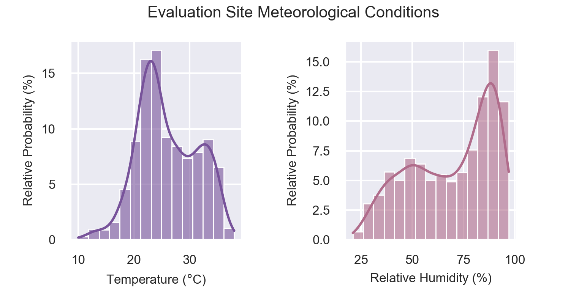
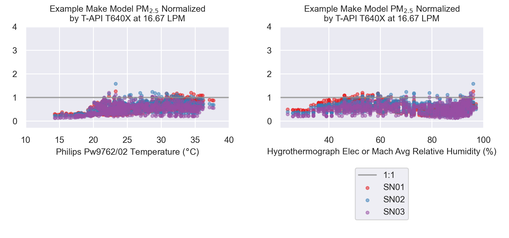
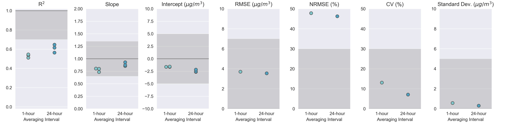
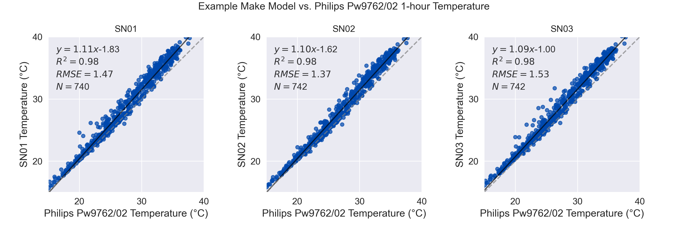
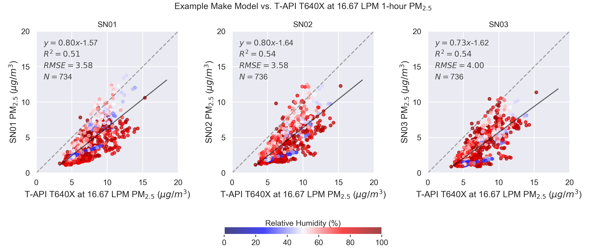
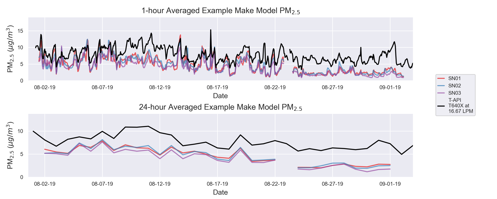

Plotting Methods
----------------

.. role:: raw-html(raw)
   :format: html

Below is a description of the plotting methods included alongside ``SensorEvaluation``.
Example figures are shown for each plotting method.

.. note::

  This section provides a brief overview of the plotting methods accessed via
  instances of the ``SensorEvaluation`` class. For more detail on calling these
  methods, click on the link to the API documentation indicated below each
  plotting method header.

.. tip::

  Some figure elements may appear difficult to view as formatted on this webpage.
  A larger version of each figure can be displayed in a separate browser tab by
  right-clicking on figures and selecting "Open image in new tab" from the dialog box.

-----

``SensorEvaluation.plot_met_dist()``
^^^^^^^^^^^^^^^^^^^^^^^^^^^^^^^^^^^^

`API Documentation for plot_met_dist() <../../api/_autosummary/sensortoolkit.evaluation_objs._sensor_eval.SensorEvaluation.html#sensortoolkit.evaluation_objs._sensor_eval.SensorEvaluation.plot_met_dist>`_

Description
"""""""""""

Displays the relative frequency of meteorological measurements recorded during the
testing period. Temperature (left) and relative humidity (right) measurements are displayed on
separate subplots. Measurements are grouped into 15 bins, and the frequency of measurements within bin
is normalized by the total number of measurements (i.e., the relative frequency) is
displayed as a histogram. Additionally, a polynomial estimating
the kernel density of measurements is shown for each subplot and indicates the
general distribution of measurements over the range of recorded values.

This method will prioritize plotting meteorological measurements made by
reference instruments, as sensor measurements are commonly biased warmer and drier than
ambient conditions if measurements are made by an onboard sensing component within
the housing of the air sensor. If no meteorological reference measurements are
available, the method will use sensor measurements; however, a disclaimer will displayed
above subplots indicating that sensor measurements are shown in the figure.

Example
"""""""

-----

``SensorEvaluation.plot_met_influence()``
^^^^^^^^^^^^^^^^^^^^^^^^^^^^^^^^^^^^^^^^^

`API Documentation for plot_met_influence() <../../api/_autosummary/sensortoolkit.evaluation_objs._sensor_eval.SensorEvaluation.html#sensortoolkit.evaluation_objs._sensor_eval.SensorEvaluation.plot_met_influence>`_

Description
"""""""""""

Displays the influence of meteorological parameters (temperature or relative
humidity) on sensor measurements. Sensor measurements that have been normalized
by reference measurement values for the corresponding timestamp and are plotted
along the y-axis. Meteorological measurements as measured by temperature or
relative humidity monitors (rather than onboard sensor measurements) are plotted
along the x-axis. Scatter for each sensor are displayed as separate colors to
indicate the unique response of each sensor unit.

The gray 1:1 line indicates ideal agreement between sensor and reference measurements
over the range of meteorological conditions (i.e., a ratio of 1 would indicate
that the sensor and reference measure the same concentration value for a given timestamp).
Scatter below the 1:1 line indicates underestimation bias, and scatter above the 1:1 line
indicates overestimation bias.

Example
"""""""

meteorological parameter (either temperature or relative humidity).

-----

``SensorEvaluation.plot_metrics()``
^^^^^^^^^^^^^^^^^^^^^^^^^^^^^^^^^^^

`API Documentation for plot_metrics() <../../api/_autosummary/sensortoolkit.evaluation_objs._sensor_eval.SensorEvaluation.html#sensortoolkit.evaluation_objs._sensor_eval.SensorEvaluation.plot_metrics>`_

Description
"""""""""""

Results for evaluating sensor performance against U.S. EPA's recommended performance metrics
and target values are displayed via a set of adjacent subplots corresponding to each metric.

Results for the following metrics are shown:

- Linearity:

  - :math:`R^2`: The coefficient of determination, which is a measure of linearity between sensor
    and reference measurement pairs.

- Bias:

  - Slope: The slope of the ordinary least-squares regression between sensor (y-axis) and
    reference (x-axis) measurements.
  - Intercept: The intercept term of the ordinary least-squares regression between sensor (y-axis) and
    reference (x-axis) measurements.

- Error:

  - :math:`RMSE`: The root mean square error between sensor and reference measurements.
  - :math:`NRMSE`: The normalized root mean square error between sensor and reference measurements, where
    RMSE has been normalized by the mean reference concentration during the testing period.

- Precision:

  - :math:`CV`: The coefficient of variation of concurrently recorded sensor measurements.
  - :math:`SD`: The standard deviation of concurrently recorded sensor measurements.

Results are shown as either colored dots (if the number of sensors is less than four) or as
boxplots (if the number of sensors exceeds three). Target ranges are indicated by gray shaded
regions, and target goals are indicated by dark gray lines. Results are grouped by data
averaging interval, including 1-hour and 24-hour intervals (note that some pollutants such as
O3 are analyzed only at 1-hour intervals due to significant diurnal variability, so the
formatting of the figure will depend on which averaging interval(s) are indicated for the parameter
via the ``sensortoolkit.Parameter.averaging`` attribute).

Example
"""""""

-----

``SensorEvaluation.plot_sensor_met_scatter()``
^^^^^^^^^^^^^^^^^^^^^^^^^^^^^^^^^^^^^^^^^^^^^^

`API Documentation for plot_sensor_met_scatter() <../../api/_autosummary/sensortoolkit.evaluation_objs._sensor_eval.SensorEvaluation.html#sensortoolkit.evaluation_objs._sensor_eval.SensorEvaluation.plot_sensor_met_scatter>`_

Description
"""""""""""

If the air sensor being analyzed measures temperature and/or relative humidity and
sensors are collocated alongside reference instrumentation measuring these meteorological
parameters, sensor-reference measurement pairs can be displayed as scatter using the
``plot_sensor_met_scatter()`` method.

Sensor measurements are plotted along the
y-axis with reference measurements along the x-axis. Statistical quantities are displayed
for each scatter plot including the ordinary least-squares (OLS) regression equation, :raw-html:`R2`,
RMSE, and N (the number of measurement pairs). The one-to-one line (indicating ideal agreement between
sensor and reference measurements) is shown as a dashed gray line.

Example
"""""""

-----

``SensorEvaluation.plot_sensor_scatter()``
^^^^^^^^^^^^^^^^^^^^^^^^^^^^^^^^^^^^^^^^^^

`API Documentation for plot_sensor_scatter() <../../api/_autosummary/sensortoolkit.evaluation_objs._sensor_eval.SensorEvaluation.html#sensortoolkit.evaluation_objs._sensor_eval.SensorEvaluation.plot_sensor_scatter>`_

Description
"""""""""""

Sensor measurements are plotted along the
y-axis with reference measurements along the x-axis. Statistical quantities are displayed
for each scatter plot including the ordinary least-squares (OLS) regression equation, :raw-html:`R2`,
RMSE, and N (the number of measurement pairs). The one-to-one line (indicating ideal agreement between
sensor and reference measurements) is shown as a dashed gray line.

Measurement pairs (i.e., concentration values for sensor and reference datasets recorded
at matching timestamp entries) are colored by the relative humidity
recorded by an independent meteorological instrument at the monitoring
site if RH data are located within the ``reference_object.data['Met']`` dataset.

Example
"""""""

-----

``SensorEvaluation.plot_timeseries()``
^^^^^^^^^^^^^^^^^^^^^^^^^^^^^^^^^^^^^^

`API Documentation for plot_timeseries() <../../api/_autosummary/sensortoolkit.evaluation_objs._sensor_eval.SensorEvaluation.html#sensortoolkit.evaluation_objs._sensor_eval.SensorEvaluation.plot_timeseries>`_

Description
"""""""""""

Displays sensor and FRM/FEM reference measurements on a time series plot.
Sensor measurements are indicated by distinct colors in a discrete color palette.
FRM/FEM measurements are shown as black lines. The x-axis indicates the date in
5-day increments (default, although customizable). Measurement values are plotted
along the y-axis.

Example
"""""""

