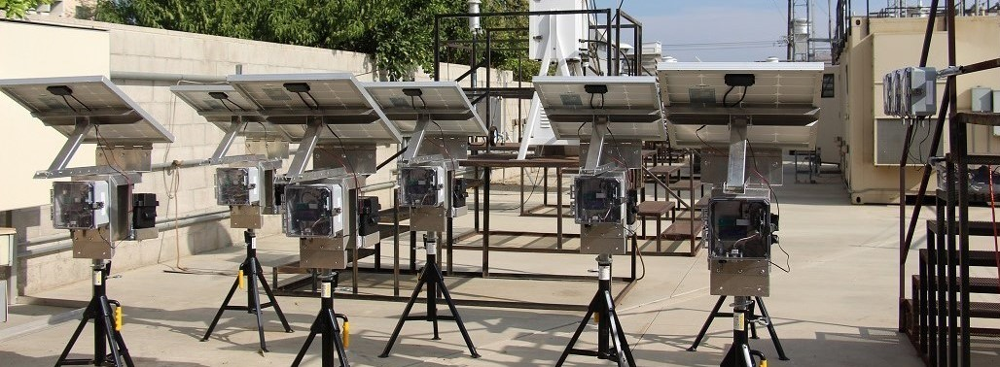

================================================
sensortoolkit - Air Sensor Data Analysis Library
================================================

*Sensors at an ambient air monitoring site. Photo Credit - South Coast AQMD AQ-SPEC Program*

----

.. role:: raw-html(raw)
   :format: html

.. admonition:: Disclaimer

  The United States Environmental Protection Agency (EPA) GitHub project code is
  provided on an “as is” basis and the user assumes responsibility for its use.
  EPA has relinquished control of the information and no longer has responsibility
  to protect the integrity , confidentiality, or availability of the information.
  Any reference to specific commercial products, processes, or services by service 
  mark, trademark, manufacturer, or otherwise, does not constitute or imply their
  endorsement, recommendation or favoring by EPA. The EPA seal and logo shall not
  be used in any manner to imply endorsement of any commercial product or activity
  by EPA or the United States Government.

Description
^^^^^^^^^^^

sensortoolkit is a Python library for evaluating air sensor data. The library is
intended for use with sensors collocated at ambient air monitoring sites alongside
FRM/FEM monitors for comparison and analysis of sensor data against
reference-grade data.

`sensortoolkit` can be used to evaluate sensor data for a single or multiple
sensors measuring one of the following pollutants:
:raw-html:`PM1, PM2.5 [criteria], PM10 [criteria], CO [criteria],
NO, NO2 [criteria], NOx, O3 [criteria], SO2 [criteria], SOx`.

sensortoolkit is most suitable for individuals who have some prior coding
experience in python. The library is equipped with an API (application
programming interface) that allows for ease of navigation and customization,
making sensortoolkit accessible to individuals with a wide range of skillsets
(e.g.,  individuals interested in monitoring their own sensor data, students
and academic researchers, and industry professionals).

Key Features
^^^^^^^^^^^^

**The primary goal of sensortoolkit is to provide a platform for analyzing air sensor
data regardless of formatting differences across sensor data formatting schemes.**
This goal extends to reference data as well, and interactive setup modules are
included for interpreting the recorded format for datasets for subsequent ingestion
into standardized formatting schemes for sensor and reference data.

- Import sensor data via a standardized ingestion process and interactive setup module
-	Average to 1-hour and/or 24-hour averaging intervals.
-	Import FRM/FEM reference data from a variety of sources, including ingestion modules for importing data from AirNowTech, and modules for querying either the  AQS or AirNow API services.
-	Submit queries for single or multiple parameters, parse datasets into a consistent reference data format and save unmodified and processed datasets to a data directory.
-	Conduct analysis with the `SensorEvaluation` module

  *	Compute U.S. EPA’s recommended performance metrics for evaluating :raw-html:`PM2.5` and :raw-html:`O3` sensors.
  *	Visualize sensor performance with various figures and save to file location.

      *	Sensor vs. FRM/FEM scatter plots
      *	Timeseries indicating both sensor and FRM/FEM concentrations
      * Performance metric results and comparison against target values/ranges.
      *	Save performance evaluation results, statistics, and supplemental information detailing the deployment conditions to a deployment JSON file.

-	Create testing reports using U.S. EPA’s base-testing report template (PowerPoint file) with the `PerformanceReport` module.
-	Additional modules are included for calculating quantities (AQI, :raw-html:`PM2.5` NowCast, application of sensor correction equations, the U.S. Wide correction equation for PurpleAir sensors via Barkjohn et al. 2021 [#f1]_, etc.) and conducting additional analysis (quality control modules for identifying outliers, invalidation of datapoints, A&B channel cleaning for PurpleAir data via Barkjohn et al. 2021 [#f1]_, etc.)
-	Access to modules utilized by the `SensorEvaluation` and `PerformanceReport` for greater customization in conducting analysis.

.. rubric:: Footnotes

.. [#f1] Barkjohn, K. K., Gantt, B., and Clements, A. L.: Development and application of a United States-wide correction for PM2.5 data collected with the PurpleAir sensor, Atmos. Meas. Tech., 14, 4617–4637, https://doi.org/10.5194/amt-14-4617-2021, 2021.

U.S. EPA's Performance Targets Reports
^^^^^^^^^^^^^^^^^^^^^^^^^^^^^^^^^^^^^^

In February 2021, U.S. EPA released two reports outlining recommended performance
testing protocols, metrics, and target values for fine particulate matter (:raw-html:`PM2.5`)
and ozone (:raw-html:`O3`) air sensors used in
non-regulatory, supplemental, and informational monitoring (NSIM) applications.

.. sidebar:: Links to U.S. EPA's Reports

  * `Fine Particulate Matter Report <https://cfpub.epa.gov/si/si_public_record_Report.cfm?dirEntryId=350785&Lab=CEMM>`_
  * `Ozone Report <https://cfpub.epa.gov/si/si_public_record_Report.cfm?dirEntryId=350784&Lab=CEMM>`_

The sensortoolkit library includes numerous modules for computing performance metrics recommended by
U.S. EPA for evaluating  (:raw-html:`PM2.5`) and ozone (:raw-html:`O3`) sensors. Additionally,
plotting functions are included for visualizing performance evaluation results, including
visualization of sensor performance metric values against U.S. EPA's performance targets,
sensor time series, scatter plots comparing collocated sensor and reference measurements,
distribution plots for displaying the range of meteorological conditions during the
deployment, etc. Tabular statistics and figures can be automatically compiled into
testing reports recommended by U.S. EPA's performance targets documents for testing
conducting at ambient air monitoring sites.

.. note::

    Presently, evaluation of sensor performance with sensortoolkit using
    U.S. EPA’s recommended performance metrics and target values is limited to
    :raw-html:`PM2.5` and :raw-html:`O3`.

FRM/FEM data may not be available at all testing sites for non-criteria
pollutants (:raw-html:`PM1`, NO,
:raw-html:`NOx`, :raw-html:`SOx`, etc.). Testers should ensure that sensors are
collocated alongside reference instrumentation capable of reporting 1-hour and/or
24-hour concentration values for evaluation parameters of interest.

.. toctree::
    :caption: Documentation Overview
    :titlesonly:

    quickstart
    install
    import_sensortoolkit
    testingattrib_objects/index
    evaluation_objects/index
    data_structures/index
    sdfs/index

.. toctree::
    :hidden:
    :caption: API Documentation

    api/index

Indices and tables
==================

* :ref:`genindex`
* :ref:`modindex`
