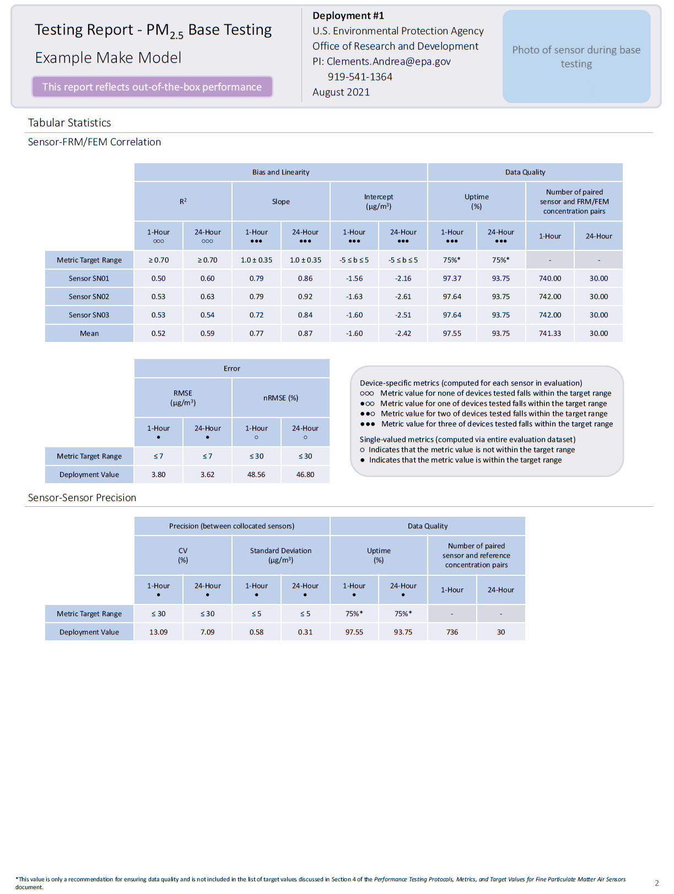
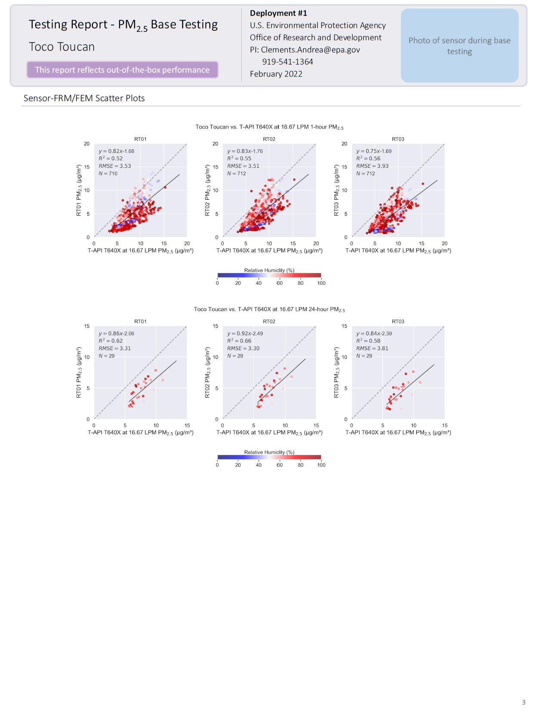

***********************************************
Creating Testing Reports with PerformanceReport
***********************************************

Creating testing reports with ``sensortoolkit.PerformanceReport`` is very similar to using
the ``sensortoolkit.SensorEvaluation`` class. Users pass the same attributes to the
``PerformanceReport`` class as they do to conduct analysis with ``SensorEvaluation``
(``PerformanceReport`` is an inherited class of ``SensorEvaluation``, which means that
its initialization creates a ``SensorEvaluation`` instance and is used to construct reports).

There are a few additional attributes users can pass to the ``PerformanceReport``
class, including the dictionaries ``testing_org`` and ``testing_loc``. These
dictionaries house information about the testing organization, contact information,
and site details including the address, coordinates, and site AQS ID if applicable.

Below is an example of running the `PerformanceReport` class to create a testing
report for the ``Example_Make_Model`` sensor evaluating its PM2.5 performance.

.. code-block:: python

  pollutant = sensortoolkit.Parameter('PM25')

  # Instantiate the PerformanceReport class for the example sensor dataset
  test_report = sensortoolkit.PerformanceReport(
                                name=sensor_name,
                                param=pollutant,
                                path=work_path,
                                reference_data=ref_path,
                                serials={'1': 'SN01',
                                         '2': 'SN02',
                                         '3': 'SN03'},
                                tzone_shift=5,
                                load_raw_data=False,
                                write_to_file=True,
                                testing_org=testing_org,
                                testing_loc=testing_loc)

  # Compile the report and save the file to the reports subfolder
  test_report.CreateReport()

Console Output:
**Change this output**

.. code-block:: console

  Loading processed sensor data
  ..Example_Make_Model_SN01_daily.csv
  ..Example_Make_Model_SN01_full.csv
  ..Example_Make_Model_SN01_hourly.csv
  ..Example_Make_Model_SN02_daily.csv
  ..Example_Make_Model_SN02_full.csv
  ..Example_Make_Model_SN02_hourly.csv
  ..Example_Make_Model_SN03_daily.csv
  ..Example_Make_Model_SN03_full.csv
  ..Example_Make_Model_SN03_hourly.csv
  Loading reference dataframes
  ..2019-08
  ....H_201908_PM.csv
  ....H_201908_Met.csv
  ....H_201908_Gases.csv
  ..2019-09
  ....H_201909_PM.csv
  ....H_201909_Met.csv
  ....H_201909_Gases.csv
  Computing normalized O3 values (by Teledyne API Model 265E And T265)
  Computing normalized O3 values (by Teledyne API Model 265E And T265)
  Computing mean parameter values across concurrent sensor datasets
  Computing mean parameter values across concurrent sensor datasets
  Populating deployment dataframe with evaluation statistics
  Computing CV for 1-Hour averaged O3
  ..N excluded: 20 out of 756 total.
  ..N concurrent: 736
  ..Concurrent Measurement Timeframe: 2019-08-01 13:00:00 - 2019-09-02 00:00:00
  Computing CV for 24-Hour averaged O3
  ..N excluded: 2 out of 32 total.
  ..N concurrent: 30
  ..Concurrent Measurement Timeframe: 2019-08-02 00:00:00 - 2019-09-01 00:00:00
  Computing regression statistics for Example_Make_Model vs Teledyne API Model 265E And T265
  Computing regression statistics for Example_Make_Model vs Teledyne API Model 265E And T265
  ../Data and Figures/eval_stats/Example_Make_Model/Example_Make_Model_O3_vs_Teledyne_API_Model_265E_And_T265_stats_df_210521.csv
  Computing regression statistics for Example_Make_Model vs Intersensor_mean_O3
  Computing regression statistics for Example_Make_Model vs Intersensor_mean_O3
  ../Data and Figures/eval_stats/Example_Make_Model/Example_Make_Model_O3_vs_Intersensor_mean_O3_stats_df_210521.csv
  Creating Testing Report for Example_Make_Model
  ..Adding figures to report
  ..Adding tabular data
  ..Saving report
  ....\Reports\Example_Make_Model\O3\Base_Testing_Report_O3_Example_Make_Model_210521.pptx

Example Report
--------------

Below is an example report (first page only) for the ``Example_Make_Model`` sensor. The first
page of the testing report allows testers to insert information about their
organization including contact information, and testers are also encouraged to
provide details about the sensor and FRM/FEM instrumentation used for testing.

Please note that at present, ``PerformanceReport`` does not populate the FRM/FEM
Instrumentation table with calibration dates, flowrate verification checks, and
any description of maintenance activities conducted on the reference instrumentation.
Users must either insert these details manually by placing information in the
provided table, or by appending documentation to the end of the report and noting on
the supplemental information page that addition documentation has been attached.

Various plots generated via the ``PerformanceReport`` class are displayed below
information about the deployment. These figures provide indication of the sensor's
performance during the testing period, site conditions including temperature and
relative humidity, and meteorological influences that may be present in sensor data.

.. figure:: data/performance_report_example_pg1.png
   :align: center

   Example_Make_Model Base Testing Report (Page 1)

  Example_Make_Model Base Testing Report (Page 2)

   Example_Make_Model Base Testing Report (Page 3)
