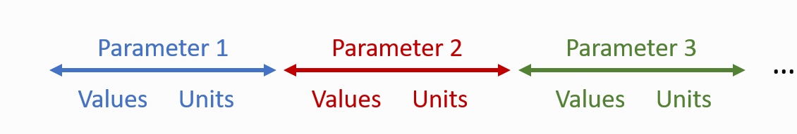

sensortoolkit Data Formatting Scheme (SDFS)
===========================================

.. role:: raw-html(raw)
   :format: html

Sensor and reference data are often presented in a wide range of formats. This
can present challenges when analyzing datasets, as differences in formatting may
require different scripting approaches. Converting both sensor and reference
datasets into a common formatting standard allows for ease of use in accessing
and analyzing these datasets.

The sensortoolkit Data Formatting Scheme (SDFS) presents a formatting
standard for displaying and cataloging collocated datasets for air sensors
and reference measurements. SDFS is intended for use with timeseries datasets
recorded via continuous monitoring at a configuring sampling frequency, whereby
a timestamp is logged for each consecutive measurement.

.. note::

  Sensor and reference datasets are automatically converted into the SDFS format
  after running the setup modules for both sensor and reference. For more
  information on these setup modules, please see AirSensor Setup for more
  information about importing and processing sensor data and ReferenceMonitor
  Setup for more information on importing and processing reference monitor data.

SDFS datasets for sensor and reference measurements differ slightly, however,
all SDFS datasets share a common organizational structure. The dataset index,
named ``DateTime``, is a timeseries index containing successive timestamps in
`ISO 8601 <https://www.iso.org/iso-8601-date-and-time-format.html>`_ format.
Timestamps and corresponding measurement entries are presented in ascending
format (i.e., the head of datasets display the oldest entries, and
the tail of datasets contain the newest entries).

Quantities that are measured by an air sensor or reference monitor continuously
and at a configured sampling frequency are referred to as Parameters. These may
be environmental/meteorological conditions (e.g., temperature, relative
humidity, wind speed, etc.) or pollutant concentrations (:raw-html:`PM2.5`,
:raw-html:`O3`, etc.). The following naming convention is used for
naming columns that are associated with parameter quantities or data:

.. csv-table:: `Table of SDFS Parameters`
   :file: ../data/S_DFS.csv
   :header-rows: 1
   :widths: auto

For each parameter, data for measured quantities are organized into a column
labeled ``[parameter]_Value`` (where parameter is the name given to the parameter
in the table listed above).

Alongside parameter values, an immediately adjacent column displays the units of
measure for the parameter, labeled ``[parameter]_Unit``.

Columns containing information for a particular parameter are grouped together,
so that visually, datasets containing multiple parameters are depicted in the
following way:

r.

   Grouping of parameter columns in SDFS datasets.

A noted previously, reference datasets differ slightly in their presentation.
Specifically, in addition to parameter columns for measurement values and units,
other parameter metadata columns are included. This includes information about
quality control flags and a description of the reference method used to collect
the parameter measurements. Below is a list of parameter columns included in
reference datasets:

.. list-table:: Parameter columns for SDFS reference datasets
  :widths: 50 75
  :header-rows: 1

  * - Column name
    - Description
  * - ``[parameter]_Value``
    - Parameter measurement recorded by device
  * - ``[parameter]_Unit``
    - Parameter units of measure
  * - ``[parameter]_QAQC_Code``
    - Quality assurance/quality control flags assigned either by the agency |br|
      overseeing the FRM/FEM instrumentation at the monitoring site or |br|
      assigned during user analysis
  * - ``[parameter]_Param_Code``
    - Air Quality System (AQS) parameter code
  * - ``[parameter]_Method``
    - FRM/FEM instrument name
  * - ``[parameter]_Method_Code``
    - Air Quality System (AQS) method code for FRM/FEM
  * - ``[parameter]_Method_POC``
    - Method parameter occurrence code (May be > 1 if multiple FRM/FEM |br|
      instruments measuring the same parameter at the monitoring site)

In addition to the timestamp index and parameter columns discussed above,
further columns are included in SDFS datasets detailing information about
the location of the sensor or reference monitor. Measurements are assumed to be
collected at an ambient, outdoor, fixed site monitoring station, and the
following columns are included for cataloging these siting attributes:

.. list-table:: Siting metadata columns for SDFS reference datasets
  :widths: 50 75
  :header-rows: 1

  * - Column name
    - Description
  * - ``Agency``
    - Agency overseeing the ambient air monitoring site and FRM/FEM |br|
      instrumentation
  * - ``Site_Name``
    - Name of the ambient air monitoring site
  * - ``Site_AQS``
    - The Air Quality System site identifier (AQS ID), if applicable
  * - ``Site_Lat``
    - The latitude of the monitoring site
  * - ``Site_Lon``
    - The longitude of the monitoring site
  * - ``Data_Source``
    - The reference data service used to acquire data
  * - ``Data_Acquisition_Timestamp``
    - The date and time that data were downloaded or acquired locally

Example SDFS Datasets
"""""""""""""""""""""

.. centered:: **Sensor SDFS Dataset**

.. csv-table::
   :file: ../data/SDFS_sensor_example.csv
   :header-rows: 1
   :widths: auto

---------

.. centered:: **Reference SDFS Dataset**

.. csv-table::
  :file: ../data/SDFS_ref_example.csv
  :header-rows: 1
  :widths: auto

.. |br| raw:: html

  
