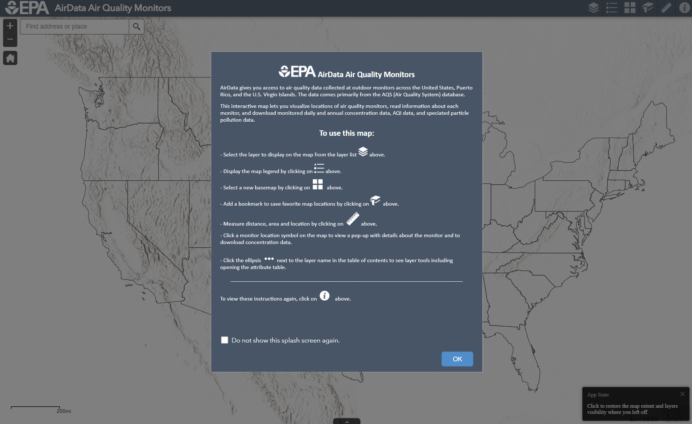
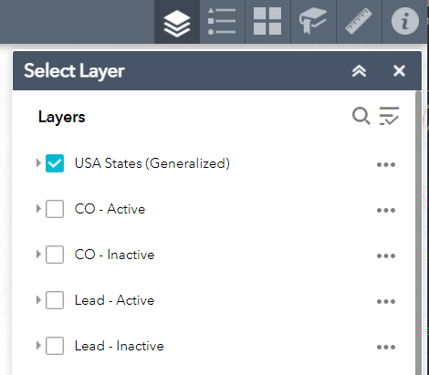
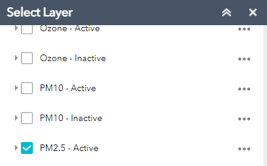
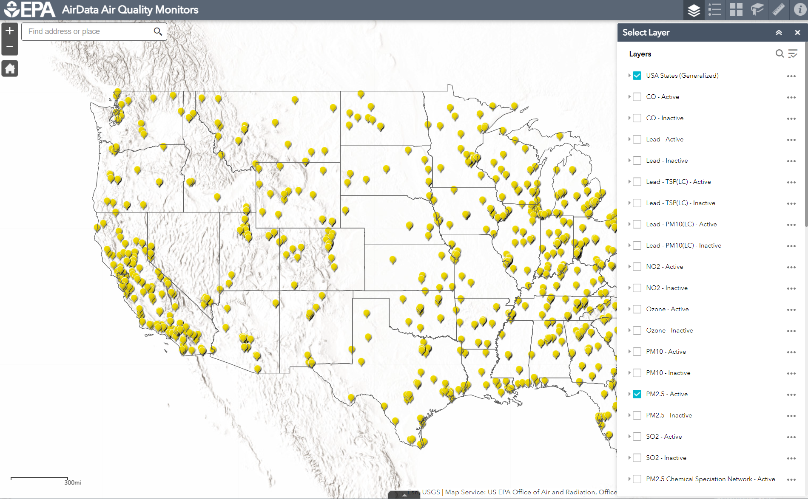
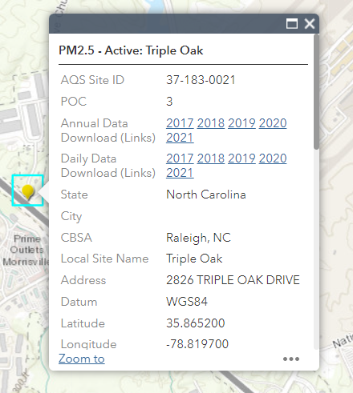

# sensortoolkit - Troubleshooting

## Table of Contents
* [Installation](#install)
* [Determining a site's AQS ID](#siteid)
* [Downloading reference data from AirNow-Tech](#airnowtech)

## Installation <a name="install"></a>

### SSL Certificate Error

If you are installing sensortoolkit from a device which is managed on a corporate network, your company's firewall settings may result in the following
SSLError message during installation.

```
(Caused by SSLError(SSLCertVerificationError(1, '[SSL: CERTIFICATE_VERIFY_FAILED] certificate verify failed: unable
to get local issuer certificate (_ssl.c:1129)'))) - skipping
```

The suggested fix is to indicate the various python servers that are used to download the dependencies as trusted sources during package installation, i.e.,

```
pip install . --trusted-host pypi.python.org --trusted-host files.pythonhosted.org --trusted-host pypi.org
```
<!--

As a side note, I’ve found that on some workplace systems, users may not have authorization to install the package globally for all users, and instead need to specify installation only for their account. This can be done by append –-user to the installation command:

>> pip install . –-user --trusted-host pypi.org --trusted-host pypi.python.org --trusted-host files.pythonhosted.org
-->

## Using AirData to Determine a Site's AQS ID <a name="siteid"></a>

To determine the AQS Site ID for an ambient monitoring site at which sensors have been collocated alongside reference monitors, use EPA’s [AirData Air Quality Monitors Map](https://epa.maps.arcgis.com/apps/webappviewer/index.html?id=5f239fd3e72f424f98ef3d5def547eb5)





Click ‘OK’ to close the splash screen.

In the top right-hand corner, click on the layers button (icon with a set of stacked squares). By default, the ‘USA States’ layer is selected.

Scroll through the list and find the pollutant you are interested in evaluating. Layers labeled ‘Active’ correspond to sites that are actively reporting to AQS.

<!--

-->

Clicking on a layer will display sites with reference monitors measuring the indicated pollutant.

Below, the “PM2.5 – Active” displays all US sites in the AQS database that are actively monitoring and reporting.





Navigate to a site of interest, either via use of the search bar in the top left-hand corner or by manually zooming in on the region in which the site is located. Clicking on the site pin will bring up information about the site and monitors measuring the specified pollutant. Ensure the address and site name correspond to the site where the air sensors were collocated. The AQS Site ID is listed at the top of the site information menu.

## Downloading Reference Data from AirNow-Tech
